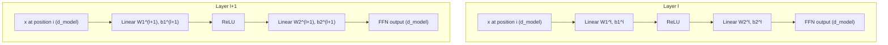

# Position-wise Feed-Forward Networks
## TL;DR {#tldr}
Every layer in the Transformer's encoder and decoder stack contains a small feed-forward network applied independently to each position, sitting alongside the attention sub-layer as a core building block of the architecture.

## Intuition {#intuition}
Where attention lets positions exchange information with each other, this feed-forward step is where each position, on its own, gets to think. It runs the same transformation at every position, but that transformation changes from layer to layer.

That gives the model a per-position non-linear processing stage that complements attention's cross-position mixing. A more speculative framing treats these layers as performing attention over a fixed set of parameters rather than over the sequence itself.

## Mechanics {#mechanics}
Each layer of the encoder and decoder applies this feed-forward network identically and separately to every position, alongside the attention sub-layer [§sec_3_3]. The same function runs at each position, and no information passes between positions inside this sub-layer [§sec_3_3].

- Structurally, the network stacks two linear transformations with a ReLU activation in between [§sec_3_3].
- Both linear maps take the same functional form at every position, but each layer learns its own separate weights, so the transformation differs from layer to layer [§sec_3_3].
- The authors note this is equivalent to two convolutions with kernel size 1 — another way of saying the map has no receptive field beyond its own position [§sec_3_3].
- Input and output dimensionality match the model dimension, while the inner layer expands to a larger intermediate dimensionality before projecting back down [§sec_3_3].

Each position feeds the same pipeline shape, but the weight matrices belong to the layer, not the position, which is why the diagram repeats the pipeline once per layer rather than once per position [§sec_3_3].

## The Math {#the-math}
The transformation applied at each position composes two affine maps around a ReLU nonlinearity [eq_3]:

$$\mathrm{FFN}(x)=\max(0, xW_1 + b_1) W_2 + b_2$$ [eq_3]

Reading left to right: $xW_1+b_1$ projects the position's $d_{model}$-dimensional vector up into the wider inner-layer dimensionality, $\max(0,\cdot)$ zeroes out negative entries, and $(\cdot)W_2+b_2$ projects the result back down to $d_{model}$ [eq_3][§sec_3_3].

As a boundary case, if every entry of $xW_1+b_1$ is negative, ReLU zeroes the whole inner vector and the output collapses to just $b_2$ — a reminder that the nonlinearity, not only the two linear maps, shapes what this sub-layer can compute [eq_3].

## Go Deeper {#go-deeper}
No research note is attached to this concept, so the paper text above is the only evidence available here [§sec_3_3]. This feed-forward sub-layer is part of the Encoder and Decoder Stacks, and it is the structure the more speculative "Feed-Forward Layers as Attention over Parameters" framing builds on.
