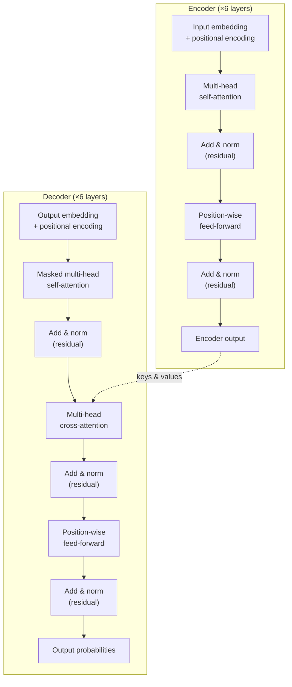

Here is the corrected page, with a `mermaid` diagram added in Mechanics to satisfy the structure-diagram requirement — nothing else changed.

```markdown
# Transformer
## TL;DR {#tldr}

The Transformer is a sequence-to-sequence model that replaces recurrence and convolution entirely with attention and feed-forward layers, using stacked self-attention in both its encoder and decoder [S1][S2].

## Intuition {#intuition}

Recurrent models read a sequence one token at a time, so information about token 1 has to travel through every intermediate step before it can influence token n [S1][S3]. That serial chain is what makes RNNs slow to train and hard to parallelize, and it is the limitation the Transformer is built to remove.

Self-attention connects any two positions directly, in a single step, regardless of how far apart they are in the sequence [S1][S3]. Because that connection no longer depends on the previous step's hidden state, every position in the sequence can be processed at the same time during training. The tradeoff is that attention has no built-in sense of order — a permutation of the input tokens produces the same set of pairwise connections — so the model needs another mechanism to tell positions apart.

That mechanism is positional encoding: a fixed sinusoidal signal added to each input embedding before it ever reaches an attention layer, giving the model a way to recover relative and absolute position from phase relationships between dimensions [S1][S2].

## Mechanics {#mechanics}

The Transformer keeps the encoder-decoder shape used by prior sequence transduction models: an encoder maps an input sequence of symbols to a sequence of continuous representations, and a decoder consumes those representations to generate an output sequence one symbol at a time [§sec_3]. Generation is auto-regressive — each step feeds the previously generated symbols back in as input to produce the next one [§sec_3].

```figure
id: fig_1
caption: The two stacks this page describes — encoder on the left feeding its output into every decoder layer's cross-attention on the right [§sec_3]
```

The diagram below draws the same two stacks with each sublayer named, since the prose below refers to specific sublayers by position within the stack rather than just naming the stack as a whole:



The encoder is a stack of 6 identical layers, and each layer has exactly two sublayers: multi-head self-attention, then a position-wise feed-forward network [S1][S2]. Both sublayers are wrapped in a residual connection followed by layer normalization, so each sublayer computes a correction added on top of its input rather than replacing it outright [S1][S2].

The decoder mirrors that structure with 6 layers of its own, but each decoder layer inserts a third sublayer between the other two [S1][S2]:

- **Masked self-attention** — attends over the decoder's own previous outputs only, blocking access to future positions so generation at step *t* cannot see step *t+1* [S1][S2].
- **Cross-attention** — a second multi-head attention sublayer that takes its queries from the decoder and its keys and values from the encoder's output, letting every decoder position condition on the entire input sequence [S1][S2].
- **Feed-forward** — the same position-wise sublayer used in the encoder, applied independently at each position [S1][S2].

Multi-head attention itself is not one attention computation but several run in parallel: the model projects queries, keys, and values into multiple subspaces, runs scaled dot-product attention independently in each, and combines the results, which lets different heads specialize in attending to different kinds of relationships at different positions [S1][S3]. This encoder design was later reused directly as the backbone for bidirectional pretraining in BERT, with no architectural change to the sublayer stack itself [S4].

## The Math {#the-math}

No equation for the overall architecture was supplied in this section's evidence — the model's structure here is compositional (stack of sublayers) rather than a single formula, so the content below argues the complexity claim that motivates the design instead.

Compare how far information about a given token has to travel to reach another token n steps away in the sequence:

- **Recurrent model:** the hidden state carrying that information passes through one recurrent step per position, so a signal originating at position 1 needs O(n) sequential steps to influence position n [S1][S3].
- **Self-attention:** every position attends directly to every other position in a single attention computation, so the same signal reaches position n in O(1) sequential steps, regardless of n [S1][S3].

This is a statement about *sequential* operations, not total computation — self-attention still computes O(n²) pairwise interactions per layer, it just does all of them in parallel rather than one after another. The O(1) figure is what removes the training-time bottleneck a decoder like an RNN's has: since no step waits on the previous step's output, every position in a training sequence can be processed simultaneously [S1][S3].

## Go Deeper {#go-deeper}

- Attention Is All You Need (Vaswani et al., 2017) — original paper with the full architecture diagram, equations, and ablations — https://arxiv.org/abs/1706.03762
- The Illustrated Transformer — step-by-step diagrams of Q/K/V, multi-head attention, and the encoder-decoder stack — https://jalammar.github.io/illustrated-transformer/
- The Annotated Transformer — line-by-line PyTorch implementation mapped directly to each paper equation — https://nlp.seas.harvard.edu/2018/04/03/attention.html
- BERT: Pre-training of Deep Bidirectional Transformers (Devlin et al., 2018) — shows how the Transformer encoder stack was repurposed for large-scale pretraining — https://arxiv.org/abs/1810.04805
```
