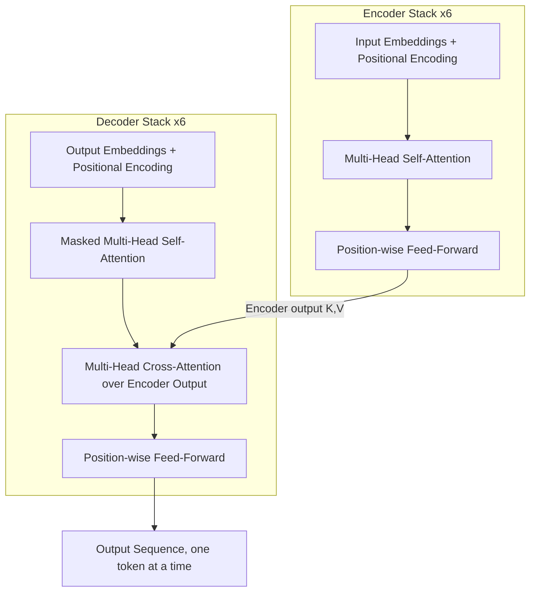

# Transformer
## TL;DR {#tldr}

The Transformer replaces recurrence and convolution entirely with attention and point-wise feed-forward layers, building an encoder-decoder architecture for sequence transduction [§sec_3].

The encoder turns an input sequence into continuous representations; the decoder consumes those representations and generates the output sequence one token at a time, auto-regressively feeding each generated token back in as input [§sec_3].

## Intuition {#intuition}

Recurrent models must process a sequence step by step, so the representation at position n cannot be computed until every earlier position has been processed — training and inference stay inherently sequential [S1][S3].

The Transformer removes that constraint: self-attention connects any two positions directly, in a single step, so every position in a sequence can be processed in parallel during training [S1][S3].

Because self-attention has no notion of order on its own, fixed sinusoidal positional encodings are added to the input embeddings so the model can recover relative and absolute position from phase relationships [S1][S2].

## Mechanics {#mechanics}

The encoder maps an input sequence of symbols to a sequence of continuous representations; the decoder then generates the output sequence one symbol at a time, consuming previously generated symbols as additional input at each auto-regressive step [§sec_3].

Both stacks repeat the same shape six times, but the sublayers inside each layer differ:

- **Encoder**: 6 identical layers, each with a multi-head self-attention sublayer followed by a position-wise feed-forward sublayer, both wrapped in a residual connection and layer normalization [S1][S2].
- **Decoder**: 6 layers mirroring the encoder, but with an added masked (causal) self-attention sublayer that blocks attending to future tokens, plus a second multi-head attention sublayer that performs cross-attention over the encoder's output [S1][S2].
- **Multi-head attention**: several scaled dot-product attention functions run in parallel on projected subspaces, letting the model jointly attend to information from different representation subspaces at different positions [S1][S3].



Each sublayer is wrapped the same way, which is what makes a 6-layer stack trainable:

```algorithm
title: Encoder layer forward pass
lines:
  - code: "x = LayerNorm(x + SelfAttention(x))"
    intent: "Multi-head self-attention lets each position gather information from every other position; the residual connection and layer norm around it stabilize training in the deep 6-layer stack [S1][S2]"
  - code: "x = LayerNorm(x + FeedForward(x))"
    intent: "The position-wise feed-forward sublayer then transforms each position's representation independently, again wrapped in a residual connection and layer norm [S1][S2]"
```

This encoder stack was later reused directly as the backbone for bidirectional pretraining in BERT, without modification to the layer structure itself [S4].

## The Math {#the-math}

No display equation was supplied in this evidence, so the mechanism to work through is the complexity argument the paper uses to motivate the whole design [S1][S3].

Self-attention connects any two positions with O(1) sequential operations; a recurrent model needs O(n) sequential steps, where n is the sequence length, because each step depends on the previous hidden state [S1][S3].

**Worked example:** for a 10-token sequence, an RNN needs 10 sequential steps before token 1 can influence token 10's representation, since each step waits on the prior hidden state [S1][S3]. Self-attention computes that same relationship in one operation, because the query and key vectors for any two positions are compared directly regardless of how far apart they are [S1][S3].

## Go Deeper {#go-deeper}

- resource: Attention Is All You Need (Vaswani et al., 2017) — original paper with the full architecture diagram, equations, and ablations — https://arxiv.org/abs/1706.03762
- resource: The Illustrated Transformer — step-by-step diagrams of Q/K/V, multi-head attention, and the encoder-decoder stack — https://jalammar.github.io/illustrated-transformer/
- resource: The Annotated Transformer — line-by-line PyTorch implementation mapped directly to each paper equation — https://nlp.seas.harvard.edu/2018/04/03/attention.html
- resource: BERT: Pre-training of Deep Bidirectional Transformers (Devlin et al., 2018) — shows how the Transformer encoder stack was repurposed for large-scale pretraining — https://arxiv.org/abs/1810.04805
