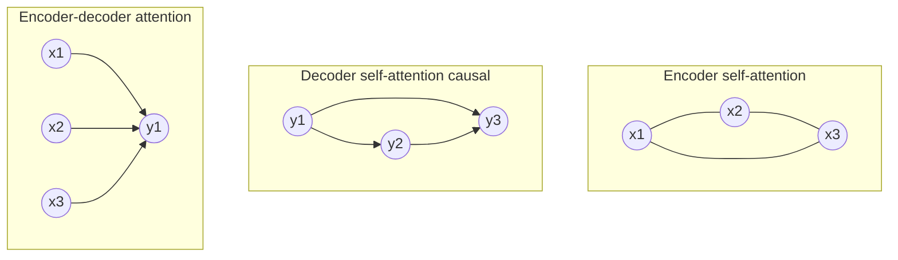

# Applications of Attention in the Model
## TL;DR {#tldr}

The Transformer uses multi-head attention in three distinct roles, distinguished only by where the queries, keys, and values come from and which positions are allowed to see which:

- **Encoder-decoder attention** — decoder queries attend over the full encoder output.
- **Encoder self-attention** — every encoder position attends to every other encoder position.
- **Decoder self-attention** — every decoder position attends only to itself and earlier positions, enforced by masking.

## Intuition {#intuition}

Attention lets a position gather information from other positions by computing a weighted combination of their values, where the weights come from how well queries match keys. The three uses in this section differ only in one design choice: which positions belong to the query set and which positions belong to the key/value set [§sec_3_2_3].

Encoder-decoder attention lets the decoder look at the encoder. Encoder self-attention lets the source look at itself. Decoder self-attention lets the target look at itself, but only at what has already been generated [§sec_3_2_3].

## Mechanics {#mechanics}

| Attention type | Queries from | Keys & values from | Attention pattern |
|---|---|---|---|
| Encoder-decoder attention | Previous decoder layer | Encoder output | Every decoder position attends over all input positions [§sec_3_2_3] |
| Encoder self-attention | Output of previous encoder layer | Same (previous encoder layer) | Every encoder position attends to all positions in the previous encoder layer [§sec_3_2_3] |
| Decoder self-attention | Previous decoder layer | Same (previous decoder layer) | Each decoder position attends only to positions up to and including itself [§sec_3_2_3] |



This encoder-decoder pattern mirrors the attention mechanisms used in earlier sequence-to-sequence models, where a decoder query searches over encoder states rather than being restricted to its own sequence [§sec_3_2_3].

The decoder must stay auto-regressive: predicting position i must not use information from positions after i. Scaled dot-product attention enforces this by masking every illegal connection before the softmax, setting those score entries to −∞ before normalization so they receive zero attention weight [§sec_3_2_3].

## The Math {#the-math}

No display equation was supplied specifically for this concept — the routing rules above are structural, not formulas. What follows is a worked trace of the masking mechanism the paper describes for decoder self-attention.

```algorithm
title: Masking illegal connections in decoder self-attention
lines:
  - code: "scores = Q @ K.T / sqrt(d_k)"
    intent: "Compute raw compatibility between every query position and every key position, as in scaled dot-product attention [§sec_3_2_3]"
  - code: "scores[i, j] = -inf for all j > i"
    intent: "Zero out the softmax weight for any key position j that comes after query position i, since the decoder must not see future tokens [§sec_3_2_3]"
  - code: "weights = softmax(scores, axis=-1)"
    intent: "Normalizing after masking sends the probability of every illegal connection to exactly zero, leaving weight only on positions up to and including i [§sec_3_2_3]"
  - code: "output = weights @ V"
    intent: "The masked, normalized weights combine only legal value vectors, preserving the auto-regressive property position by position [§sec_3_2_3]"
```

For a 3-token target sequence, the legal key set grows by one position at a time:

| Query position | Can attend to | Masked out |
|---|---|---|
| 1 | {1} | {2, 3} |
| 2 | {1, 2} | {3} |
| 3 | {1, 2, 3} | {} |

Setting an illegal score to −∞ before the softmax is what forces its weight to zero, because raising e to a very large negative power drives the result toward zero no matter how large the original dot-product was. Any masked position therefore contributes nothing to the output [§sec_3_2_3].

## Go Deeper {#go-deeper}

The paper points readers to a figure illustrating this masking pattern; that figure was not supplied as evidence here, so it is not reproduced [§sec_3_2_3].

This section only specifies the routing of queries, keys, and values; it relies on the scaled dot-product attention and multi-head attention formulas defined earlier in the paper, which are not reproduced here because no equation evidence was supplied for this concept [§sec_3_2_3].
