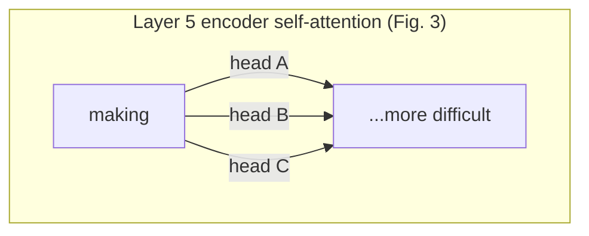

# Attention Visualizations
## TL;DR {#tldr}

The paper's appendix shows what individual encoder self-attention heads actually latch onto in real sentences — not benchmark numbers, but qualitative pictures of learned behavior. Heads track long-distance grammatical dependencies, resolve pronouns back to their antecedents, and specialize toward different syntactic roles, all from layer 5 of 6 [§sec_8][S1].

## Intuition {#intuition}

Think of each attention head as a different reader skimming the same sentence with a different question in mind. One reader is hunting for "what does this verb eventually connect to, even many words later?" Another is asking "what does this pronoun refer back to?" A third is tracking looser structural patterns tied to how the sentence is built. The paper's visualizations make this concrete by drawing colored lines from a chosen word to whatever tokens that word's attention weight lands on, one color per head [§sec_8].

This matters because it's independent evidence that [[Multi-Head Attention]] isn't just a bigger matrix multiply — different heads are doing recognizably different linguistic jobs on the same input, without being told to.

## Mechanics {#mechanics}

**Long-distance dependency tracking:** Figure 3 isolates the attention distribution for the word "making" in layer-5 encoder self-attention. Many heads assign substantial weight not to nearby words but to the distant tokens completing the phrase "making...more difficult," spanning most of the sentence rather than staying local [fig_3][S1].



```figure
id: fig_3
caption: A single word's attention weights, color-coded by head, reaching across the sentence to the phrase it grammatically completes — evidence that self-attention isn't a local window operation.
```

**Anaphora resolution:** Figure 4 isolates two heads (5 and 6), also from layer 5 of 6, attending from the pronoun "its" back toward its antecedent. The attention mass for this word is described as "very sharp," meaning the distribution concentrates on a small number of tokens rather than spreading diffusely [fig_4][S1].

```figure
id: fig_4
caption: Two heads' attention from the word 'its', shown both in full and isolated — the sharp concentration is the head effectively pointing at the antecedent.
```

**Structure-sensitive heads:** Figure 5 gives two more layer-5 heads whose attention patterns track sentence structure rather than raw position or lexical overlap, and the two heads visibly perform different tasks from each other [fig_5][S1].

```figure
id: fig_5
caption: Two different heads from the same layer, attending along different structural patterns — direct evidence that heads specialize rather than converge on one strategy.
```

Every example the paper shows comes from the same depth — layer 5 of 6 — so these are not claims about what shallow or deep layers do differently, only about what mid-to-late encoder self-attention has learned [§sec_8][S1].

## The Math {#the-math}

No display equation is supplied for this concept — it's a qualitative appendix, not a derivation. The evidence does give a useful contrast worth reasoning through: the *sharpness* of an attention distribution.

Every attention head still outputs a softmax over the value positions it can attend to (see [[Scaled Dot-Product Attention]]), so its weights always sum to 1 across the sequence. What differs between the figures is how that mass is distributed:

- **Diffuse case (Figure 3):** the weight for "making" is spread thin but consistently across the distant phrase it depends on — the head hasn't collapsed to a single token, it's tracking a multi-token span [fig_3].
- **Peaked case (Figure 4):** the weight for "its" concentrates almost entirely on its antecedent — the softmax output is close to a one-hot vector, the extreme boundary case of the same distribution [fig_4].

Both are the same mechanism (a normalized weighted sum over values) producing qualitatively different shapes depending on what the sentence demands: a peaked distribution when there's one clear referent to point at, a broader one when the dependency itself spans a phrase rather than a single word [S1].

## Go Deeper {#go-deeper}

- [The Illustrated Transformer](https://jalammar.github.io/illustrated-transformer/) — walks through self-attention with per-head weight diagrams in the same style as Figures 3–5, on different example sentences [S2].
- [BertViz](https://github.com/jessevig/bertviz) — interactive head-by-head attention inspection on arbitrary input text, letting you reproduce this kind of visualization yourself rather than trusting only the paper's fixed examples [S3].
- [The Annotated Transformer](https://nlp.seas.harvard.edu/annotated-transformer/) — line-by-line implementation, useful for seeing exactly where the attention weights being visualized here are computed before they're rendered.
