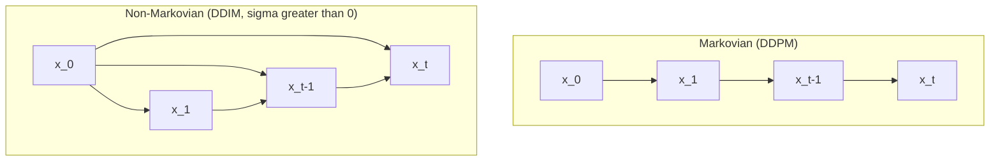

# Non-Markovian Forward Processes

## TL;DR {#tldr}

DDIM builds a whole family of forward processes q_σ(x_{1:T} | x_0), one for each vector σ, that all share DDPM's single-step marginals q(x_t | x_0). Because training only ever uses those marginals, a network trained under the original Markovian DDPM objective works unchanged under any member of this family — only the reverse sampler changes.

## Intuition {#intuition}

DDPM's forward process adds noise to x_0 one Markov step at a time: x_t depends only on x_{t-1}. DDIM asks a different question: is there another family of processes with the exact same marginals q(x_t|x_0), but where each step also gets to look at x_0 directly?

The answer is yes, and σ is the knob that picks which member of that family you get. Large σ keeps the step nearly as noisy as DDPM's own posterior; σ → 0 removes the randomness entirely, turning the reverse process into a deterministic map — the DDIM sampler.

## Mechanics {#mechanics}

The joint distribution is built backward from x_T: q_σ(x_{1:T}|x_0) factors as q_σ(x_T|x_0) times a product of reverse-time conditionals q_σ(x_{t-1}|x_t,x_0) for t=2,…,T, each one Gaussian. [§sec_3_1]

Each of those conditionals has a mean that is a function of both x_t and x_0, plus fixed variance σ_t². That mean function is chosen, not free, so that the resulting marginal q_σ(x_t|x_0) matches DDPM's own N(√α_t x_0, (1−α_t)I) exactly. [§sec_3_1]

Matching that marginal is what lets a network trained under the original DDPM objective — which only ever sees single-step marginals — run under any σ without retraining. [§sec_3_1]

Because the mean depends on x_0 as well as x_t, x_{t-1} is no longer conditionally independent of x_0 given x_t — the defining property of a Markov chain breaks. [§sec_3_1]



**The dependency edge DDPM's Markov chain omits:** in DDIM's construction x_{t-1} has a direct edge from x_0, not just from x_t, so knowing x_0 changes what we know about x_{t-1} even after conditioning on x_t. [§sec_3_1]

The scale of σ_t sets how much of q_σ(x_{t-1}|x_t,x_0)'s mass sits at its mean versus spread around it — large σ_t keeps the step close to DDPM's own noisy posterior. [§sec_3_1]

Applying Bayes' rule to these reverse conditionals yields a forward process q_σ(x_t|x_{t-1},x_0), which turns out to be Gaussian as well, though the paper does not use that fact again. [eq_6]

## The Math {#the-math}

The evidence supplies one display equation for this construction: the Bayes' rule identity that recovers the forward direction from the reverse conditionals used to build q_σ. [eq_6]

$$
q_\sigma(\vx_{t} | \vx_{t-1}, \vx_0) = \frac{q_\sigma(\vx_{t-1} | \vx_{t}, \vx_0) q_\sigma(\vx_{t} | \vx_0)}{q_\sigma(\vx_{t-1} | \vx_0)},
$$
[eq_6]

```annotated-eq
latex: "q_\\sigma(\\vx_{t} | \\vx_{t-1}, \\vx_0) = \\frac{q_\\sigma(\\vx_{t-1} | \\vx_{t}, \\vx_0) q_\\sigma(\\vx_{t} | \\vx_0)}{q_\\sigma(\\vx_{t-1} | \\vx_0)}"
terms:
  - tex: "q_\\sigma(\\vx_{t} | \\vx_{t-1}, \\vx_0)"
    role: 1
    words: "The quantity being solved for: the forward-direction step, derived rather than assumed [eq_6]"
  - tex: "q_\\sigma(\\vx_{t-1} | \\vx_{t}, \\vx_0)"
    role: 2
    words: "The reverse conditional that the whole family q_sigma is defined from [§sec_3_1]"
  - tex: "q_\\sigma(\\vx_{t} | \\vx_0)"
    role: 3
    words: "The marginal at step t, fixed to equal DDPM's own marginal by construction [§sec_3_1]"
  - tex: "q_\\sigma(\\vx_{t-1} | \\vx_0)"
    role: 4
    words: "The marginal at step t-1, likewise fixed to match DDPM [§sec_3_1]"
```

Every term on the right side of this identity is already fixed once σ is chosen: the two marginals match DDPM by construction, and the reverse conditional is the Gaussian the family is defined from. [eq_6]

That means the left side — the forward step — is not an independent design choice; it is whatever falls out of dividing and multiplying quantities already fixed by the marginal-matching constraint. [eq_6]

**Boundary case — σ_t → 0 for every t:** the variance in q_σ(x_{t-1}|x_t,x_0) vanishes, so the reverse conditional collapses onto its mean. [§sec_3_1]

Once x_t and x_0 are both observed, that mean is a fixed number — x_{t-1} is determined exactly rather than sampled. [§sec_3_1]

Chaining that determinism across every step turns the whole reverse process into a fixed map from x_T to x_0, which is the deterministic DDIM sampler this construction sets up. [§sec_3_1]

## Go Deeper {#go-deeper}

- Builds on the main DDIM paper and requires the Unified Variational Inference Objective, which shows every choice of σ produces the same training loss.
- The exact mean function of q_σ(x_{t-1}|x_t,x_0) — elided in this excerpt — is spelled out in the q_σ(x_1:T|x_0) Construction page.
- The discrete-state analogue of this same non-Markovian idea is covered in Non-Markovian Forward Process (Discrete Case).
