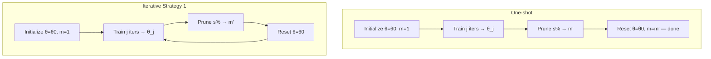

```markdown
# One-Shot Pruning
## TL;DR {#tldr}
One-shot pruning trains a network once, prunes the target fraction of weights in a single step, and stops — it is the single-round (n = 1) case of the multi-round procedure the paper calls iterative pruning.

## Intuition {#intuition}
Think of the mask-building loop the paper uses for winning tickets as a dial with one setting: how many times you go around the train-prune-reset cycle before you stop. Turn that dial to one round and you have one-shot pruning; turn it up and you have the iterative procedure the paper builds winning tickets with.

The two differ only in whether the network gets to retrain between prune decisions. One-shot commits to every pruning decision from a single trained snapshot; the multi-round version re-earns each additional cut from a network that has already been retrained on the smaller mask.

## Mechanics {#mechanics}
The paper's Appendix defines the multi-round procedure as a loop over four steps: initialize `θ = θ0` with mask `m = 1`, train for `j` iterations to `θ_j`, prune `s%` to form an updated mask `m'` with `P_{m'} = (P_m − s)%`, then reset the surviving weights to `θ0` and repeat from training until the network is "sufficiently pruned" [§sec_9]. One-shot pruning is what remains if that repeat is dropped: run the loop body exactly once, with `s` set to the whole target sparsity instead of a partial cut.

The two named strategies in the Appendix, resetting and continued training, are both multi-round — they differ from each other only in whether retraining after a prune step resumes from `θ0` or from the already-trained weights, not in how many rounds they use [§sec_9]. One-shot pruning sits outside that comparison entirely: it never reaches a second prune decision, so the resetting-versus-continued-training question the Appendix studies never arises for it.


The loop-back edge in Strategy 1 is exactly the step one-shot pruning omits [§sec_9].

```algorithm
title: One-shot pruning as the single-round case of Strategy 1
lines:
  - code: "θ = θ0; m = 1^{|θ|}"
    intent: "Start from the full, unpruned network at its original initialization [§sec_9]"
  - code: "train f(x; m ⊙ θ) for j iterations → θ_j"
    intent: "One-shot pruning still trains once before deciding which weights to cut, exactly as step 2 of the iterative procedure does [§sec_9]"
  - code: "prune s% of θ_j, forming m' with P_{m'} = (P_m − s)%"
    intent: "The prune rule itself is identical to the iterative rule; the only difference is the value of s [§sec_9]"
  - code: "stop — do not reset θ and repeat"
    intent: "Omitting the repeat in steps 2–4 is the single change that turns Strategy 1 or 2 into one-shot pruning [§sec_9]"
  - code: "θ = θ0; m = m'"
    intent: "Both procedures still reset the surviving weights to their original initialization before the network is evaluated [§sec_9]"
```

## The Math {#the-math}
The Appendix's per-round rule is arithmetic subtraction of remaining-parameter percentage:
$$
P_{m'} = (P_m - s)\%
$$
[§sec_9]

Reading this rule across rounds gives the algebraic relationship between one-shot and iterative pruning. If the target is to keep only `100 − T` percent of parameters, one-shot pruning applies the rule once with `s = T`. Iterative pruning applies it `n` times, each round cutting a smaller `s ≈ T/n`, so that `n` successive subtractions land on the same final sparsity `100 − T` [§sec_9].

**Worked example:** to reach 90% sparsity (`T = 90`), one-shot pruning removes `s = 90` in a single step straight after the first `j`-iteration training run. An iterative run with `n = 9` rounds of `s = 10` reaches `P_{m'} = 100 − 10k` after round `k`, hitting `P = 10` (90% pruned) only at round 9 — but each of those 9 rounds resets the surviving weights to `θ0` and retrains them before the next cut is made [§sec_9]. The one-shot network gets exactly one such train-then-evaluate pass on its final mask; the iterative network gets nine.

That repeated retrain-and-reevaluate cycle is the mechanism the Appendix figures actually test, though only among multi-round variants: fig_9 and fig_10 compare Strategy 1 (reset before each retrain) against Strategy 2 (continue training through each prune step) on Lenet and the Conv-2/4/6 networks, and report that Strategy 1 keeps higher validation accuracy and faster early-stopping down to smaller network sizes [fig_9][fig_10]. That result is about which multi-round strategy is better, not about one-shot versus iterative pruning directly — the supplied evidence does not include a figure comparing one-shot pruning's accuracy against either iterative strategy.

## Go Deeper {#go-deeper}
No external learning resources were supplied for this concept.

```figure
id: fig_9
caption: What one-shot pruning skips — the early-stopping accuracy that Strategy 1's repeated reset-and-retrain rounds buy over Strategy 2 on Lenet, a comparison that only exists once you commit to more than one round [§sec_9]
```

The most direct next read is the paper's own multi-round definitions, → Iterative Magnitude Pruning, which this page's mechanics section builds one-shot pruning out of by removing the repeat step [§sec_9].
```

One caveat worth flagging directly: the supplied local evidence (§sec_9, fig_9, fig_10) only defines and compares the two *iterative* strategies — it never states or measures one-shot pruning's own accuracy. I built the one-shot procedure and worked example as the explicit n=1 boundary case of the documented loop, but I did not find or fabricate a direct one-shot-vs-iterative accuracy comparison, since none was in evidence.
