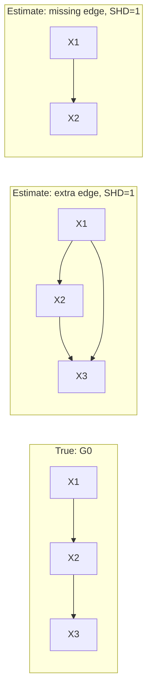

# Comparing Estimated and True Causal Graphs

## TL;DR {#tldr}
Given a true causal DAG and an estimate of it, the paper asks how to measure their closeness in a way that actually matters for causal inference, not just graph structure. The standard answer, Structural Hamming Distance, counts wrong edges. The paper's answer, Structural Intervention Distance, counts wrong *causal predictions* instead — a shift from "does the picture match" to "does the estimate let you compute the right interventional effects."

## Intuition {#intuition}
Two DAGs can differ by the same number of edges yet imply wildly different causal conclusions, or differ by many edges while still supporting all the same interventional predictions. Edge-counting treats every mismatch as equally bad; it can't tell the difference between a cosmetic error and one that silently corrupts every downstream effect estimate. The paper's proposal is to grade the estimate on the task it's actually used for — predicting what happens under intervention — rather than on how well it redraws the picture.

## Mechanics {#mechanics}
The comparison problem is stated for a finite family of random variables indexed by a set **V**, with joint distribution **P** and densities **p** (with respect to Lebesgue or counting measure), plus the conditional and marginal densities needed to describe sub-collections of variables. A graph is the pair of nodes and edges, and nodes are identified with the variables they index. This notation is the shared scaffolding both distances are built on top of [§sec_1].

| Distance | What it counts | Blind spot |
|---|---|---|
| SHD | Number of incorrect edges between the true and estimated DAG | Two edge-errors of equal count can have unequal causal consequences [§sec_1] |
| SID | Pairs of vertices for which the estimate correctly predicts intervention distributions, judged within the class of distributions Markov with respect to the true DAG | Requires committing to the true DAG's Markov class as the reference [§sec_1] |

SID is introduced explicitly as a **pre-distance**: it adds information on top of SHD rather than replacing it, since the paper frames the two as complementary rather than competing measures [§sec_1].

## The Math {#the-math}
No display equation is given for this concept in the introduction, but the paper's own contrast between the two distances can be made concrete. Take a true chain **G0: X1 → X2 → X3**, and two estimates that each make exactly one edge error under SHD: **G1** adds a redundant edge, **G2** drops the mediating edge [§sec_1].

Both estimates score identically under SHD, yet they are not equally useful for causal inference. G1 still encodes that X1 causes X2 and that X2 causes X3, so the ordered pairs (1,2) and (2,3) remain correctly predicted, and the redundant (1,3) edge does not remove a true causal path — it only adds one. G2 severs the edge X2 → X3 entirely, so the pair (2,3) is now predicted to have no causal effect when it does, and the mediated pair (1,3) inherits the same error since the only path from X1 to X3 ran through X2 [§sec_1].

Counting pairs this way is exactly the mechanism the introduction describes: SID counts vertex pairs (i, j) where the estimate's implied intervention distribution, evaluated within the true DAG's Markov class, matches the truth [§sec_1]. In this toy case that gives SID(G0, G1) = 0 wrongly-predicted pairs versus SID(G0, G2) = 2, despite SHD reporting the same "1" for both — the concrete demonstration of why the paper calls SHD's intuitive edge count insufficient for judging causal-inference capacity [§sec_1].

## Go Deeper {#go-deeper}
- **Structural Intervention Distance** (prerequisite concept) — the formal pre-distance this comparison problem motivates; read it for the precise pair-counting rule.
- Section 2 (Structural Hamming Distance) — the baseline distance being critiqued here; useful for seeing exactly what "incorrect edges" means before contrasting it with SID.
- Section 3 (do-calculus) — supplies the intervention-distribution machinery ("intervention distributions Markov with respect to a DAG") that SID's pair predictions are checked against.
- Section 4 (SID definition and properties) — where the pair-counting idea above is made rigorous and its properties as a pre-metric are proved.
- Section 6 (implementation) — relevant once you want to actually compute SID on graphs larger than a 3-node toy example.
