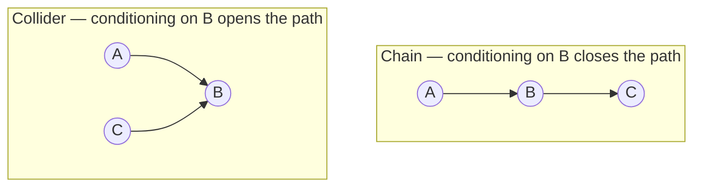

# DAG Terminology
## TL;DR {#tldr}
SID compares a true DAG with an estimate that may represent an entire equivalence class. The paper therefore fixes a vocabulary for graph structure, orientation, and shared independence structure before defining SID.

This page covers subgraphs, parent sets, skeletons, paths, ancestry, PDAGs, chain graphs, and Markov equivalence. Later definitions of adjustment sets and DAG-to-CPDAG comparison rely on these terms.

## Intuition {#intuition}
| Graph feature | What it records | Why SID needs it |
|---|---|---|
| Skeleton | Which variable pairs are connected | It captures structure without an orientation |
| Orientation | Which way a connection points | It determines parent sets for adjustment |

Directed paths impose causal order: an ancestor can influence a descendant, never the reverse. A DAG is acyclic because no descendant can return to be its own ancestor.

Path blocking has two opposite cases:

- A fork or chain closes when conditioning on its middle node.
- A collider is closed by default and opens when conditioning on it or one of its descendants.

Markov-equivalent DAGs imply the same conditional independences, so observational data cannot distinguish them.

A CPDAG compresses that class. An edge is directed only when every member agrees; otherwise it is undirected.

SID must therefore compare against CPDAGs as well as DAGs. Observational causal discovery naturally returns this equivalence-class representation.

**Worked example:** compare $A\to B\to C$ with $A\to B\leftarrow C$. Conditioning on $B$ blocks the chain but opens the collider, so the same three nodes encode opposite path-blocking behavior [§sec_7].



## Mechanics {#mechanics}
**Subgraphs and skeletons separate structure from orientation.** $H$ is a subgraph of $G$ when its nodes and edges are subsets of $G$'s. It is proper when it misses at least one edge [§sec_7].

The skeleton discards direction. It treats $i \to j$, $i \leftarrow j$, and $i-j$ as the same undirected connection for edge counting [§sec_7].

**Adjacency and parenthood are two edge vocabularies.** Nodes are adjacent when any edge connects them [§sec_7].

$j$ is a parent of $k$ and $k$ a child of $j$ only for directed $j\to k$. Adjacency is skeleton-level; parenthood is its oriented counterpart [§sec_7].

**Directed paths define ancestry.** A path is a sequence of distinct, pairwise-adjacent nodes. It is directed when every edge points the same way [§sec_7].

The endpoint of a directed path is a descendant of its start; all other nodes are non-descendants. A DAG forbids two nodes from being descendants of each other [§sec_7].

**A semi-directed cycle contains at least one directed edge.** A middle node is a collider when both neighboring edges point into it, $j \to k \leftarrow l$ [§sec_7].

| Graph class | Restriction or feature |
|---|---|
| PDAG | Forbids directed cycles |
| Chain graph | Also forbids semi-directed cycles; undirected-reachable nodes form a chain component |
| DAG | A PDAG with every edge directed |

## The Math {#the-math}
The paper states the blocking rule for a path given a conditioning set $S$ as a case split on the middle node $k$, and the two cases are structurally opposite — worth walking through side by side rather than just quoting.

```derivation
shape: When does a middle node k block a path through it, given a conditioning set S (with the path's endpoints not in S)?
steps:
  - latex: "\\text{Case 1: } k \\text{ is not a collider on the path } (j \\to k \\to l \\text{ or } j \\leftarrow k \\to l)"
    why: "k passes information through by default — it is a valve that is open unless you shut it [§sec_7]"
  - latex: "k \\in S \\;\\Rightarrow\\; \\text{path is blocked}"
    why: "Conditioning on a non-collider fixes it, cutting the chain or fork it sits on [§sec_7]"
  - latex: "\\text{Case 2: } k \\text{ is a collider on the path } (j \\to k \\leftarrow l)"
    why: "A collider is a valve that is closed by default — the two arrowheads meeting at k block flow unless something forces it open [§sec_7]"
  - latex: "k \\notin S \\text{ and no descendant of } k \\text{ is in } S \\;\\Rightarrow\\; \\text{path is blocked}"
    why: "This is the reverse condition of Case 1: conditioning on a collider (or its descendant) opens the path instead of closing it — the two cases cannot be merged into one rule [§sec_7]"
```

A path family between disjoint sets $X$ and $Y$ is $d$-separated by $S$ only when every path is blocked [§sec_7].

The distribution is Markov when $d$-separation implies conditional independence, and faithful when the converse also holds [§sec_7].

Two DAGs are Markov equivalent exactly when they entail the same $d$-separations. This is a graphical test, not a distributional one [§sec_7].

That equivalence relation is what makes the CPDAG well-defined: it is the chain graph obtained by comparing every DAG in an equivalence class edge by edge.

```algorithm
title: Building the completed PDAG (CPDAG) of a Markov equivalence class
lines:
  - code: "for each pair (i, j) adjacent in some member DAG:"
    intent: "The CPDAG's skeleton is the union of skeletons across the class — equivalent DAGs share the same skeleton, so this is really just one DAG's skeleton [§sec_7]"
  - code: "    if all members orient the edge i -> j the same way:"
    intent: "Unanimous orientation means every DAG consistent with the observed independencies agrees here, so it is safe to assert the direction [§sec_7]"
  - code: "        mark edge as directed i -> j"
    intent: "This is the causally-identifiable part of the class — no additional data could ever resolve it further [§sec_7]"
  - code: "    else if members disagree on the edge's direction:"
    intent: "Disagreement means the direction is genuinely unidentifiable from the independence structure alone [§sec_7]"
  - code: "        mark edge as undirected i - j"
    intent: "Undirected marks exactly the ambiguity that SID later has to handle when its input is a CPDAG rather than a DAG [§sec_7]"
```

The cost of this construction is linear in the number of skeleton edges once the equivalence class's member DAGs (or their $d$-separation statements) are known — each edge only needs a single unanimous/split check, not a re-scan of the whole class per edge [§sec_7].

## Go Deeper {#go-deeper}
- **Structural Intervention Distance (SID)** — the direct successor concept: SID is defined on top of exactly this vocabulary, since its inputs are a true DAG and an estimated DAG *or* CPDAG, and its adjustment-set machinery is built from parent sets and $d$-separation as defined here.
- No research note is attached to this concept; the terminology itself is the resource — treat this page as the reference to return to whenever a later SID definition invokes "skeleton," "collider," "Markov equivalent," or "CPDAG" without re-explaining it.
