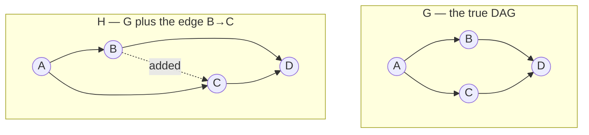

# Structural Intervention Distance (SID)
## TL;DR {#tldr}
SID is a pre-metric for comparing an estimated causal DAG with a true one when the graph will predict intervention effects.

Unlike SHD, SID counts pairwise intervention distributions that parent adjustment gets wrong. It distinguishes equally close-looking graphs whose causal predictions differ sharply.

SID also supports DAG-to-CPDAG comparisons, symmetrization, and a penalty for unwanted extra edges.

## Intuition {#intuition}
Consider two estimates with the same SHD: one adds a spurious edge and one reverses an edge. Edit distance treats those mistakes as equally severe.

An added edge can leave the parent sets useful for adjustment, so most intervention predictions remain right. A reversal can remove a confounder and systematically corrupt downstream predictions.

SID is built to notice that asymmetry. For every ordered pair, it asks whether the estimate gives the correct intervention answer.

That can make one reversed edge much more costly than one added edge, even when both cost one unit of SHD.

### Running four-node example: count the pairs

Use $G: A\to B, A\to C, B\to D, C\to D$ and $H=G+(B\to C)$.



For $\mathrm{SID}(G,H)$, the estimated parent sets are supersets of the true ones. All 12 ordered pairs pass, so the SID error matrix is empty and $\mathrm{SID}(G,H)=0$ [§sec_2_3; sid.py:L183-L253].

Now swap the arguments. For $\mathrm{SID}(H,G)$, estimate $G$ omits true parent $B$ from $C$'s adjustment set. Exactly two ordered pairs fail: $(C,B)$ and $(C,D)$. Thus $\mathrm{SID}(H,G)=2$ [eq_7; sid.py:L183-L253].

**Worked example:** this pair-by-pair result exposes all three ideas at once. SHD is one, SID is asymmetric, and one extra edge is free only in the truth-to-superset direction.

## Mechanics {#mechanics}
**Correctness is defined per ordered pair over every compatible distribution.** For $i \neq j$, $H$ is correct only when its intervention distribution matches $G$'s for every observational distribution Markov to $G$ [§sec_2_1].

A fully factorized distribution could make almost any two DAGs agree. Quantifying over the full Markov-compatible family prevents that accidental agreement from hiding a structural error [§sec_2_1].

The resulting distance depends on graph structure, not on one particular distribution [§sec_2_1].

**SID maps an ordered DAG pair into the naturals.** It counts $(i,j)$ pairs whose intervention prediction under $H$ is false with respect to $G$ [§sec_2_1].

The truth and estimate roles are not interchangeable, so SID is not symmetric [§sec_2_1].

**A graphical criterion replaces infinitely many distribution checks.** Set $\mathbf{Z}$ is valid for $(X,Y)$ in $G$ exactly when it meets both conditions [eq_6]:

- no member of $\mathbf{Z}$ descends from a mediator on a directed $X$-to-$Y$ path; and
- $\mathbf{Z}$ blocks every non-directed path between $X$ and $Y$.

SID tests whether $\mathrm{PA}_H(i)$ meets this criterion for $(G,i,j)$ [§sec_2_2].

**SID therefore has a graph-only error test.** Pair $(i,j)$ is wrong in either case [eq_7]:

- $j \in \mathrm{PA}_H(i)$ but $j$ is a descendant of $i$ in $G$; or
- $j \notin \mathrm{PA}_H(i)$ and $H$'s parent set fails adjustment validity for that pair.

Both branches are graph queries, so SID needs no numerical data [§sec_2_2].

**Extra edges can be structurally free.** If true DAG $G$ is a subgraph of $H$, SID is exactly zero: parent adjustment in over-connected $H$ still recovers the correct interventions [§sec_2_3].

Missing or reversed edges can instead damage the count [§sec_2_3].

| Aspect | SHD | SID |
|---|---|---|
| Symmetric? | Yes, by construction | No — e.g. an empty estimate vs. a non-empty truth gives $\mathrm{SID}(G,H) \neq \mathrm{SID}(H,G)$ [§sec_2_3] |
| What one unit counts | One edge insertion/deletion/reversal | One ordered pair whose intervention prediction is wrong [§sec_2_1] |
| Effect of adding a superfluous (correct-direction) edge | Always costs at least 1 | Can cost 0 exactly when $G \subseteq H$ [§sec_2_3] |
| Effect of reversing one edge | Costs exactly 1 | Can cost up to $\mathcal{O}(p)$ falsely-estimated pairs if a confounder is lost [§sec_2_1] |
| Relationship when SHD = 0 | — | SID = 0 too, but the converse bound is loose and can be tight at the maximal possible SID for constant SHD [§sec_2_3] |

**CPDAG estimates require bounds.** Member DAGs can disagree on a pair's intervention prediction, and enumerating the whole equivalence class is infeasible for large graphs [§sec_2_4_1].

Instead, each chordal chain component is extended locally. Its best- and worst-case scores assemble SID's lower and upper bounds [§sec_2_4_1]:

```algorithm
title: Lower/upper SID bounds for a DAG-vs-CPDAG comparison
lines:
  - code: "for each chain component C_k of the CPDAG H:"
    intent: "Only chain components need enumeration — the CPDAG's directed edges are already fixed across the whole equivalence class [§sec_2_4_1]"
  - code: "    enumerate all DAG extensions D_1..D_m of C_k, leaving other components undirected"
    intent: "Chordality of C_k guarantees every one of these local extensions corresponds to a valid member DAG of the equivalence class [§sec_2_4_1]"
  - code: "    for each extension D_l and each vertex i in C_k: score_l += errors(i, D_l)"
    intent: "Reuses the graph-only error test from eq_7, applied vertex-by-vertex within the component [§sec_2_4_1]"
  - code: "    lower_k, upper_k = min(scores), max(scores)"
    intent: "The best- and worst-case orientation of this component bound how wrong H can be, independent of how other components are oriented [§sec_2_4_1]"
  - code: "SID_lower = sum(lower_k); SID_upper = sum(upper_k)"
    intent: "Summing per-component extremes over all components gives bounds that are each attained by some actual DAG member of the CPDAG's class [eq_8]"
```

**Operational meaning of the bounds:** the lower bound counts identifiable intervention distributions inferred falsely [eq_9].

$p(p-1)$ minus the upper bound counts identifiable distributions inferred correctly. A large gap means many pairs depend on the unknown member DAG, not a fact settled by $H$ alone [eq_9].

**Three extensions reuse the same machinery:**

- Penalizing additional edges adds an edge-count term, so a dense estimate cannot receive zero for free [§sec_2_4_3].
- Symmetrization uses $\big(\mathrm{SID}(G,H) + \mathrm{SID}(H,G)\big)/2$ when neither graph is truth [§sec_2_4_4].
- Minimal adjustment sets change conditioning-set size but changed SID only modestly in the paper's dense-graph experiment [§sec_2_4_5].

## The Math {#the-math}
The formal object being defined is a map from pairs of DAGs to a natural number, counting falsely-estimated ordered pairs, and its lead-in claim above is anchored here [eq_5]:

$$\begin{array}{rcl}
\mathrm{SID}: \; \mathbb{G} \times \mathbb{G} &\rightarrow& \mathbb{N}\\
(\G,\HH)& \mapsto &\# \{\,(i,j), i \neq j\;|\;\text{ the intervention distribution from } i \text{ to } j\\
&& \qquad \qquad \qquad \quad \text{ is falsely estimated by } \HH \text{ with respect to } \G \}
\end{array}
$$ [eq_5]

```annotated-eq
latex: "\\mathrm{SID}: \\; \\mathbb{G} \\times \\mathbb{G} \\rightarrow \\mathbb{N}"
terms:
  - tex: "\\mathrm{SID}"
    role: 1
    words: "The pre-metric being defined; note the domain is an ordered pair, so the map need not agree with itself when the arguments swap [eq_5]"
  - tex: "\\mathbb{G} \\times \\mathbb{G}"
    role: 2
    words: "Both slots range over the full DAG space — the first argument plays the role of ground truth, the second the estimate under test [eq_5]"
  - tex: "\\mathbb{N}"
    role: 3
    words: "The codomain is a plain count, at most p(p-1), not a probability or a weighted score — every wrong pair contributes exactly one unit regardless of how wrong it is [eq_5]"
```

The graphical adjustment-validity criterion that lets this count be computed without touching any actual distribution is condition $(*)$ [eq_6]:

$$(*) \left \{
\begin{array}{c}
\text{In } \G \text{, no } Z \in \B{Z} \text{ is a descendant of any } W \text{ which lies on a directed}\\
\text{path from } X \text{ to } Y \text{ and } \B{Z} \text{ blocks all non-directed paths from } X \text{ to } Y.
\end{array}
\right.
$$ [eq_6]

Substituting parent sets for $\mathbf{Z}$ throughout turns the distributional definition of eq_5 into the purely graph-based formula actually used for computation [eq_7]:

$$\SID(\G,\HH) = \# \left\{\,(i,j), i \neq j\,|\, 
\begin{array}{cl}
j \in \DE{\G}{i} & \text{if } j \in \PA{\HH}{i}\\
\PA{\HH}{i} \text{ does not satisfy } (*) \text{ for } (\G,i,j) & \text{if } j \not \in \PA{\HH}{i}
\end{array}
\right\}
$$ [eq_7]

**Why an extra parent does not break correctness:** $H \supseteq G$ implies zero SID because a superfluous adjustment variable can cancel exactly [eq_4].

In the motivating example, $H_1$ adjusts for $\{X_1,X_2,Y_1\}$ while $G$ needs only $\{X_1,X_2\}$ [eq_4]:

```derivation
shape: Show that adjusting for an unnecessary extra parent Y1 still recovers G's true intervention distribution.
steps:
  - latex: "p_{H_1}(y_3\\mid \\mathrm{do}(Y_2=\\hat y_2)) = \\sum_{x_1,x_2,y_1} p(y_3\\mid x_1,x_2,y_1,\\hat y_2)\\,p(x_1,x_2,y_1)"
    why: "Parent adjustment applied literally in H1, which lists Y1 as a parent of Y2 even though G does not [eq_4]"
  - latex: "= \\sum_{x_1,x_2,y_1} \\frac{p(x_1,x_2,y_1,\\hat y_2,y_3)}{p(\\hat y_2\\mid x_1,x_2,y_1)} = \\sum_{x_1,x_2,y_1} \\frac{p(x_1,x_2,y_1,\\hat y_2,y_3)}{p(\\hat y_2\\mid x_1,x_2)}"
    why: "The denominator simplifies because {X1,X2} already satisfies criterion (*) for this pair in G, so conditioning further on Y1 cannot change p(y2 | ...) [eq_6]"
  - latex: "= \\sum_{x_1,x_2} p(y_3\\mid x_1,x_2,\\hat y_2)\\,p(x_1,x_2) = p_{\\G}(y_3\\mid \\mathrm{do}(Y_2=\\hat y_2))"
    why: "Summing y1 out of the joint collapses the expression back to exactly G's own parent-adjustment formula, so H1's extra edge cost nothing [eq_4]"
```

**Bounding a DAG-vs-CPDAG comparison:** since a CPDAG $\CC$ represents a whole equivalence class, SID against it is not a single number but a pair of bounds, formalized as a map into $\mathbb{N} \times \mathbb{N}$ [eq_8]:

$$\begin{array}{rcl}
\mathrm{SID}: \; \mathbb{G} \times \mathbb{C} &\rightarrow& \mathbb{N} \times \mathbb{N}\\
(\G,\CC)& \mapsto & \big({\SID}_{\mathrm{lower}}(\G,\CC), {\SID}_{\mathrm{upper}}(\G,\CC)\big)
\end{array}
$$ [eq_8]

These bounds have an exact identifiability-theoretic reading [eq_9].

The lower bound counts pairs identifiable in $\CC$ and inferred falsely. $p(p-1)$ minus the upper bound counts pairs identifiable and inferred correctly.

The strictly-identifiable versions are bounded rather than pinned down [eq_9]:

$$\begin{aligned}
\# \left\{ \text{interv. distr. that are } 
\begin{array}{c}
\text{ identifiable in }\CC \text{ wrt } \G \text{ and}\\
\text{ inferred falsely by }\CC \text{ wrt } \G
\end{array}
\right\}
&\;= \;{\SID}_{\mathrm{lower}}(\G,\CC)  \\
\# \left\{ \text{interv. distr. that are } 
\begin{array}{c}
\text{ identifiable in }\CC \text{ wrt } \G \text{ and}\\
\text{ inferred correctly by }\CC \text{ wrt } \G
\end{array}
\right\}
&\;= \;p \cdot (p-1) - {\SID}_{\mathrm{upper}}(\G,\CC)\\
\# \left\{ \text{interv. distr. that are } 
\begin{array}{c}
\text{ strictly identifiable in }\CC \text{ and}\\
\text{ inferred falsely by }\CC \text{ wrt } \G
\end{array}
\right\}
&\;\leq \;{\SID}_{\mathrm{lower}}(\G,\CC)  \\
\# \left\{ \text{interv. distr. that are } 
\begin{array}{c}
\text{ strictly identifiable in }\CC \text{ and}\\
\text{ inferred correctly by }\CC \text{ wrt } \G
\end{array}
\right\}
&\;\leq \;p \cdot (p-1) - {\SID}_{\mathrm{upper}}(\G,\CC)\,.
\end{aligned}
$$ [eq_9]

**Why identifiability matters when the roles flip:** comparing estimate $H$ with a true CPDAG considers only pairs identifiable in $\CC$ [eq_10].

Otherwise SID would score $H$ against an undefined quantity. The map returns a natural-number count, rather than bounds, because only $H$ is uncertain [eq_10]:

$$\begin{array}{rcl}
\mathrm{SID}: \; \mathbb{C} \times \mathbb{G} &\rightarrow& \mathbb{N}\\
(\CC,\HH)& \mapsto &\# \{\,(i,j), i \neq j\;|\;\text{the interv. distr from $i$ to $j$ is identif. in $\CC$}\\
&& \qquad \qquad \qquad \quad \text{and } \exists \lawX \text{ that is Markov wrt } \CC_1 \in \CC \text{ such that}\\
&& \qquad \qquad \qquad \quad p_{\CC_1}(x_j\given \doo(X_i = \hat x_i)) \neq p_{\HH}(x_j\given \doo(X_i = \hat x_i)) \}
\end{array}
$$ [eq_10]

**Conclusion:** SID complements SHD by measuring causal-effect capacity, and the simulations warn that achieving a small SID may require more samples than SHD alone suggests [§sec_5].

## Go Deeper {#go-deeper}
- **Motivation and Definition of SID** — the source of the reversed-edge-vs-extra-edge example that motivates the whole design; read it for the fully worked contrast this page's Intuition compresses.
- **DAG Terminology** and **Intervention Distributions** — prerequisites defining descendants, adjustment sets, and $p(\cdot \mid \mathrm{do}(\cdot))$ that the graphical criterion $(*)$ [eq_6] and eq_7 both lean on.
- **Structural Hamming Distance (SHD)** — the contrasting edit-distance metric; the comparison table above is a compressed version of the fuller SID-vs-SHD analysis there.
- **SID between a DAG and a CPDAG** — expands the lower/upper-bound algorithm sketched here into the full chordal-extension procedure and its worst-case behavior on long chains.
- **Penalizing Additional Edges** and **Symmetrization of SID** — the two extensions that patch SID's two best-known blind spots (free extra edges, asymmetry).
- **Hidden Variables (Future Work)** and **Multiple Interventions (Future Work)** — open directions toward ADMGs/MAGs and joint interventions on node sets, both currently unresolved.
- **SID versus SHD Simulation** and **Implementation of SID** — the empirical validation and the actual computational recipe for everything defined above.
