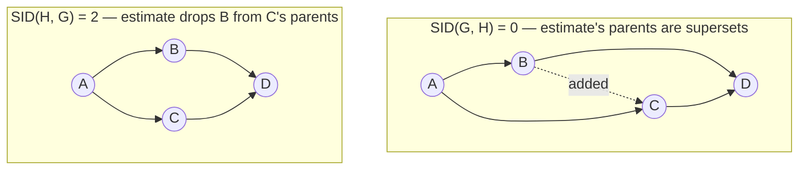

# Motivation and Definition of SID

## TL;DR {#tldr}
SID is a pre-metric for two DAGs that asks whether they make the same intervention predictions, not whether they have the same edges.

SHD treats every edge mismatch alike. SID counts ordered pairs for which an estimate computes the wrong $p(y \mid do(x))$ under the true graph.

One missing or extra edge can preserve every prediction, while one reversal can corrupt many. SHD cannot distinguish those cases.

## Intuition {#intuition}
Treat the estimate as a recipe, not a picture. Its parents specify which variables to condition on when simulating an intervention.

SHD grades resemblance. SID checks whether the recipe gives the right answer for every ordered pair on the true distribution.

Interventions are directional: asking about $Y$ after intervening on $X$ differs from the reverse question. SID therefore examines ordered pairs $(i,j)$ with $i \neq j$.

Directionality also makes SID asymmetric. Swapping truth and estimate can change the count, which lets SID distinguish estimates that appear equally wrong to SHD.

The build's running pair is the smallest case of that. With $G: A\to B, A\to C, B\to D, C\to D$ and $H=G+(B\to C)$, reading the pair one way scores $\mathrm{SID}(G,H)=0$ and the other way $\mathrm{SID}(H,G)=2$ [§sec_2_3; eq_7].



The two graphs never change; only which one is called the truth does. That alone moves the score, which is what an edge count can never do.

**Prediction check:** two estimates can each have SHD one while only the reversal damages intervention predictions. Predict which parent set loses a needed confounder before reading the paper's comparison below [§sec_2_1].

## Mechanics {#mechanics}
SID fixes one procedure for predicting an intervention distribution: **parent adjustment**, using the direct parents of the intervened-on node [§sec_2_1].

Other adjustment sets are possible and treated separately. Fixing parent adjustment makes SID computable from graph structure under Markovianity to the true DAG [§sec_2_1].

A pair $(i,j)$ is **correctly estimated** only when the estimate's parent adjustment matches the true graph's intervention distribution for every distribution Markov to that graph [§sec_2_1].

One factorized distribution could make arbitrary graphs agree, so it is not enough. Every other pair is **falsely estimated**, and SID counts them [§sec_2_1].

The paper's own worked comparison shows why edge-counting and intervention-counting diverge:

| Mistake in estimate | Change vs. true DAG | Effect on parent sets | Effect on intervention distributions |
|---|---|---|---|
| Extra edge $Z_1 \to Y$ added | +1 edge (SHD = 1) | Only $Y$'s parent set changes, gains $Z_1$ | All pairs still correct — $Z_1$ is conditionally irrelevant given $Y$'s true parents, so the extra adjustment variable cancels out [§sec_2_1] |
| Edge $X \to Y$ reversed to $Y \to X$ | 1 edge changed (SHD = 1) | $X$ loses its only parent | Several pairs become wrong, since interventions through $X$ now have no confounder to adjust for; the paper reports eight erroneous predictions for many observational distributions [§sec_2_1] |

Both mistakes cost SHD exactly one point, but only one of them costs anything under SID — which is the whole motivation for introducing it [§sec_2_1].

The implementation mirrors this logic at the level of ordered pairs rather than distributions, using reachability on the true graph and the estimate's parent sets to decide correctness directly from structure:

```algorithm
title: _sid_matrix — per-source pass over ordered pairs
lines:
  - code: "path_matrix = _compute_path_matrix(true_graph)"
    intent: "Precompute reachability once on the true DAG; every source's check reuses it [sid.py:L183]"
  - code: "if true_parents == est_parents: continue"
    intent: "Matching parent sets make the estimate's adjustment set the true back-door set for every target, so the whole source is trivially correct and skipped [sid.py:L183]"
  - code: "graph_without_conditioned_tails = true_graph; zero out rows of est_parents"
    intent: "Removing the outgoing edges of the adjustment set isolates which directed paths survive conditioning, needed to test the generalized adjustment criterion [sid.py:L183]"
  - code: "reachable_on_non_directed_path = _reachable_on_non_directed_path(...)"
    intent: "One traversal per source answers, for every target at once, whether the adjustment set blocks all non-causal paths [sid.py:L183]"
  - code: "if est_parents[target]: incorrect = not path_matrix[source, target]"
    intent: "If the target is itself in the adjustment set, the estimate predicts no effect; that is correct only when the true graph agrees there is none [sid.py:L183]"
```

## The Math {#the-math}
The definition packages the pairwise correctness check above into a single map from a pair of DAGs to a natural number [§sec_2_1]:

$$\begin{array}{rcl}
\mathrm{SID}: \; \mathbb{G} \times \mathbb{G} &\rightarrow& \mathbb{N}\\
(\G,\HH)& \mapsto &\# \{\,(i,j), i \neq j\;|\;\text{ the intervention distribution from } i \text{ to } j\\
&& \qquad \qquad \qquad \quad \text{ is falsely estimated by } \HH \text{ with respect to } \G \}
\end{array}$$ [eq_5]

```annotated-eq
latex: "\\mathrm{SID}: \\mathbb{G} \\times \\mathbb{G} \\rightarrow \\mathbb{N}"
terms:
  - tex: "\\mathrm{SID}"
    role: 1
    words: "A pre-metric, not a metric: it can be asymmetric and the argument order (true graph first) matters [§sec_2_1]"
  - tex: "\\mathbb{G}"
    role: 2
    words: "The space of DAGs over p variables — both arguments live here, but they play different roles [§sec_2_1]"
  - tex: "\\mathbb{N}"
    role: 3
    words: "The codomain is a plain count of ordered pairs, so it is bounded by p(p-1), the number of ordered pairs available [§sec_2_1]"
```

The extra-edge row of the table above is not a coincidence; it is a small instance of a general containment result, and the derivation shows exactly why the added parent $Z_1$ washes out algebraically instead of biasing the estimate:

```derivation
shape: Why adjusting for a superfluous extra parent still yields the correct interventional distribution
steps:
  - latex: "p_{\\HH_1}(y_3\\given \\doo(Y_2 = \\hat y_2)) = \\sum_{x_1,x_2,y_1} p(y_3\\given x_1,x_2,y_1,\\hat y_2)\\, p(x_1,x_2,y_1)"
    why: "Start from parent adjustment computed on the estimate H1, which conditions on Y1's full (over-complete) parent set including the extra edge [eq_4]"
  - latex: "= \\sum_{x_1,x_2,y_1} \\frac{p(x_1,x_2,y_1,\\hat y_2,y_3)}{p(\\hat y_2 \\given x_1,x_2,y_1)} = \\sum_{x_1,x_2,y_1} \\frac{p(x_1,x_2,y_1,\\hat y_2,y_3)}{p(\\hat y_2 \\given x_1,x_2)}"
    why: "Rewrite as a ratio of joint densities, then drop y1 from the conditioning of the denominator because y1 is not actually a parent of Y2 in the true DAG — this is where the extra edge's irrelevance enters [eq_4]"
  - latex: "= \\sum_{x_1,x_2} p(y_3\\given x_1,x_2,\\hat y_2)\\, p(x_1,x_2) = p_{\\G}(y_3\\given \\doo(Y_2 = \\hat y_2))"
    why: "Summing out y1 collapses the expression back to the true graph's own parent-adjustment formula, so the two intervention distributions coincide exactly, not approximately [eq_4]"
```

**Why this generalizes:** the algebra closes because the true DAG's edges are a subset of the estimate's. The true parent set already accounts for every path the extra adjustment could open [§sec_2_1].

A reversal instead deletes a true confounder from the adjustment set. No cancellation restores that missing variable, so the distributions generally disagree [§sec_2_1].

**Cost of computing it:** per-source transitive-closure reachability gives roughly quartic scaling in the number of variables [sid.py:L256].

The implementation is practical around 100 nodes but reaches roughly a minute around 200. That cost matters when simulation studies score many DAGs [sid.py:L256].

## Go Deeper {#go-deeper}
- **Equivalent Graphical Formulation** — turns the distributional definition above into a condition checkable purely from graph structure (the generalized adjustment criterion), which is what the `_sid_matrix` implementation actually runs instead of manipulating distributions directly.
- **Alternative Adjustment Sets** — this page fixes parent adjustment as *the* rule; that page examines what changes if a different valid adjustment set is used instead.
- **`SID` class / `_sid_matrix()` (sid.py)** — the concrete algorithm implementing this definition, worth reading alongside Mechanics above to see the pairwise correctness check turned into matrix operations.
