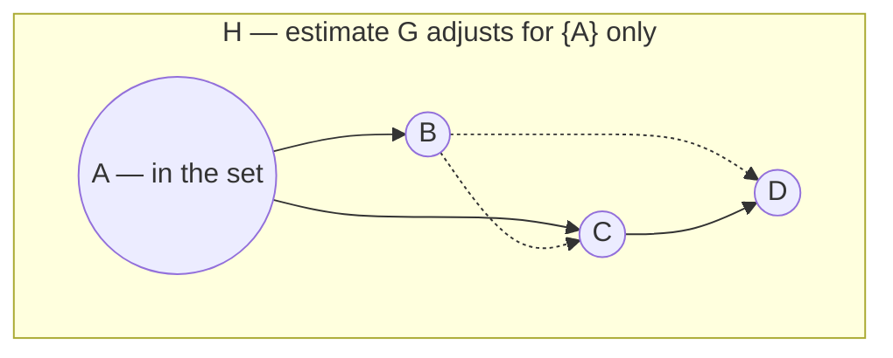

# Equivalent Graphical Formulation
## TL;DR {#tldr}
SID initially asks whether a candidate adjustment set recovers the correct intervention distribution for every variable pair.

This page replaces distributional reasoning with a graphical test: block certain paths and avoid certain descendants in the true DAG.

SID's meaning does not change. Only its computation changes, making the definition executable on graphs.

## Intuition {#intuition}
The question "does this set give the right causal effect?" appears to require comparing intervention and observational distributions.

Its answer is topological. Validity depends on descendants and blocked paths, not on numerical edge values.

Adjustment need not recover the true parent set. Several other sets can work equally well.

- A child of the treatment can work if it is not on the treatment-to-effect directed path.
- A parent can be omitted if its only unblocked route to the outcome runs back through the treatment.

The criterion accepts sets that block confounding while preserving the causal channel.

**Worked example:** in the shared graph $H=G+(B\to C)$, estimate $G$ uses $\{A\}$ for source $C$. That set leaves $C\leftarrow B\to D$ open, so condition $(*)$ rejects it for $(C,D)$ without evaluating a density [eq_6].



$B$ is a parent of $C$ in $H$ but is not in $\{A\}$, so the fork $C\leftarrow B\to D$ (dotted) stays open and no density has to be computed to reject the set.

## Mechanics {#mechanics}
**From distributions to one candidate set:** for each ordered pair $(i,j)$, SID stops searching over adjustment sets [§sec_2_2].

It checks whether estimated-graph parent set $\PA{\HH}{i}$ is valid for intervention on $i$ with respect to $j$ in true graph $\G$ [§sec_2_2].

**Why one check is enough:** a Lemma gives a two-sided characterization using condition $(*)$ [§sec_2_2].

If a candidate set satisfies $(*)$, it is valid for every distribution Markov to $\G$. If it fails, some Markov-compatible distribution makes it invalid [§sec_2_2].

The test is therefore exact, not merely sufficient.

**Consistency with the earlier definition:** when the candidate set is exactly the true parent set, $\B{Z} = \PA{\G}{i}$, condition (*) is satisfied automatically, and the Lemma collapses back to the earlier Proposition that parent-set adjustment always works [§sec_2_2].

**Relation to the classic criterion:** condition (*) is recognizable as a slight loosening of the standard back-door criterion, extended to also license certain non-parent sets as valid adjustments [§sec_2_2].

**Which non-parent sets qualify:**

- A treatment child may be included if it is not on the directed cause-to-effect path.
- A treatment parent may be omitted if every unblocked path it would create goes through the treatment [§sec_2_2].

## The Math {#the-math}
The graphical condition (*) that a candidate set $\B{Z}$ must satisfy for the pair $(X,Y)$ is stated in two parts — a descendant restriction and a path-blocking requirement [eq_6].

$$
\left \{
\begin{array}{c}
\text{In } \G \text{, no } Z \in \B{Z} \text{ is a descendant of any } W \text{ which lies on a directed}\\
\text{path from } X \text{ to } Y \text{ and } \B{Z} \text{ blocks all non-directed paths from } X \text{ to } Y.
\end{array}
\right.
$$ [eq_6]

```annotated-eq
latex: "\\left \\{ \\begin{array}{c} \\text{In } \\G \\text{, no } Z \\in \\B{Z} \\text{ is a descendant of any } W \\text{ which lies on a directed} \\\\ \\text{path from } X \\text{ to } Y \\text{ and } \\B{Z} \\text{ blocks all non-directed paths from } X \\text{ to } Y. \\end{array} \\right."
terms:
  - tex: "Z \\in \\B{Z}"
    role: 1
    words: "Any member of the candidate adjustment set — the descendant restriction has to hold for every one of them, not just some [§sec_2_2]"
  - tex: "W"
    role: 2
    words: "A mediator on the directed path from X to Y; if an adjustment variable descends from one, conditioning on it reopens or biases the causal path instead of blocking a confounding one [§sec_2_2]"
  - tex: "\\text{blocks all non-directed paths}"
    role: 3
    words: "The other half of the requirement — this is the back-door-style piece that closes off spurious association while the descendant restriction protects the causal channel itself [§sec_2_2]"
```

Substituting $\B{Z} = \PA{\HH}{i}$ into (*) for every pair turns the whole distributional definition of SID into a graph-counting formula, splitting on whether $j$ is already a parent of $i$ in the estimated graph $\HH$ [eq_7].

$$
\SID(\G,\HH) = \# \left\{\,(i,j), i \neq j\,|\, 
\begin{array}{cl}
j \in \DE{\G}{i} & \text{if } j \in \PA{\HH}{i}\\
\PA{\HH}{i} \text{ does not satisfy } (*) \text{ for } (\G,i,j) & \text{if } j \not \in \PA{\HH}{i}
\end{array}
\right\}
$$ [eq_7]

**Why the case split exists:** if $\HH$ claims $j$ as a parent of $i$, condition $(*)$ is vacuous. The check becomes whether $j$ is a descendant of $i$ in true graph $\G$ [eq_7].

If $j$ is not a claimed parent, SID tests whether $\PA{\HH}{i}$ satisfies $(*)$ in $\G$ [eq_7].

**Where tractability comes from:** each pair needs one descendant/blocking check against fixed candidate $\PA{\HH}{i}$ [§sec_2_2].

The reformulation removes both an adjustment-set search and an interventional-distribution comparison.

## Go Deeper {#go-deeper}
- **Motivation and Definition of SID** — the distributional definition this formulation replaces; read it first to see exactly which computation (*) is standing in for.
- **Proof: Equivalence of Definitions** — the appendix proof, built on the same Lemma, that formally establishes eq_7 is identical to the original definition, not just a good approximation of it.
- **Metric Properties of SID** — builds on this graphical formulation to establish SID's properties as a distance; worth checking once you trust that (*) really characterizes valid adjustment.
