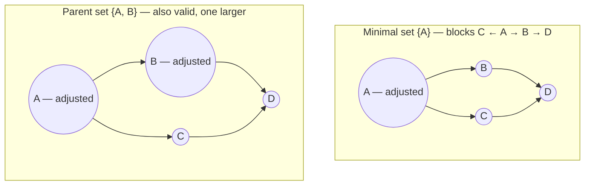

# Alternative Adjustment Sets
## TL;DR {#tldr}
SID needs an adjustment set for each intervention distribution, and the parent set is only one valid choice.

Using a minimal adjustment set changes computation but empirically barely changes SID. The verdict is therefore robust to this design choice.

## Intuition {#intuition}
Adjustment sets block confounding so a conditional distribution can stand in for an intervention. Parents are the natural local, easy-to-read choice.

Any set blocking the right paths can work, and some are smaller. This asks whether a harder but smaller set changes SID enough to outweigh parent sets' convenience.

**Worked example:** for $C\to D$ in the shared true graph, $\{A\}$ is a valid smaller set and $\{A,B\}$ is also valid. The second set adjusts for a safe extra ancestor, illustrating why validity and minimality are different questions [§sec_2_4_5; eq_6].

## Mechanics {#mechanics}
**Why parent sets are the default:** they are easy to compute and depend only on the neighbourhood of the intervened node — no need to inspect the rest of the graph — which is exactly why they are widely used in practice for adjustment [§sec_2_4_5].

**What the alternative buys:** a minimal set minimizes controlled variables, which can reduce estimation variance. Recent algorithms compute it efficiently [§sec_2_4_5].

Minimality is nevertheless global: it depends on the whole graph, unlike a node's local parent set [§sec_2_4_5].

**Non-uniqueness in the experiment:** several distinct smallest sets can block the relevant paths [§sec_2_4_5].

The experiment uses the first smallest set its search finds, rather than averaging or characterizing all minimal sets [§sec_2_4_5].

**The empirical test:** using the same dense random-graph experimental setup used elsewhere in the paper, SID was computed twice per graph pair — once with parent adjustment, once with the minimal adjustment set — and the two values were compared directly [§sec_2_4_5].

## The Math {#the-math}
No new SID formula appears here. The varied object is the adjustment-set-selection rule, not the metric.

This is a robustness check on SID's hidden design parameter.

| Property | Parent set | Minimal adjustment set |
|---|---|---|
| Computability | Easy — read directly from the graph | Harder — recent efficient algorithms exist [§sec_2_4_5] |
| Scope of dependence | Local: only the intervened node's neighbourhood [§sec_2_4_5] | Global: depends on the whole graph [§sec_2_4_5] |
| Uniqueness | Unique by definition | Not unique; smallest-found set used in experiments [§sec_2_4_5] |
| Effect on SID (empirical) | Baseline | Differences are reported as small; the exact equality percentage is missing from the extracted source, so this dashboard does not invent it [§sec_2_4_5] |

**Why near-agreement matters:** the parent-versus-minimal gap is small, especially relative to SID's gap from SHD [§sec_2_4_5].

The variants are not identical. Their residual difference is second-order, while choosing SID rather than SHD is first-order [§sec_2_4_5].

## Go Deeper {#go-deeper}
- **Motivation and Definition of SID** — the parent-based definition of SID that this concept stress-tests; read it first to see exactly where the adjustment set enters the computation.
- **The dense-random-graph experimental setup** referenced here (used elsewhere to generate the SID-vs-SHD comparisons) — worth revisiting to see the same graphs reused for this robustness check, which is what makes the two comparisons commensurable [§sec_2_4_5].
- **The paper's SID-vs-SHD comparison** — the yardstick this section measures itself against; the "especially compared to" framing only makes sense once that larger gap is in view [§sec_2_4_5].
