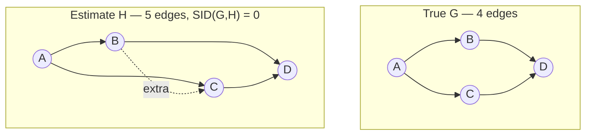

# Penalizing Additional Edges

## TL;DR {#tldr}

SID can be zero when an estimate has strictly more edges than truth.

This is deliberate: SID checks intervention effects, not parsimony. A companion edge-count distance reveals extra structure.

## Intuition {#intuition}

SID asks whether estimated-parent adjustment returns the true intervention distribution for each ordered pair.

An edge redundant to a valid adjustment set does not break that check. A denser graph can pass every SID pairwise test.

$H=G+(B\to C)$ is the shared example of exactly that: one more edge than $G$, and $\mathrm{SID}(G,H)=0$.

The dotted edge is the whole difference. SID scores it zero; only an edge count says it is there.

SID is not wrong about causal effects. Yet extra edges make a model harder to interpret and add parameters.

In finite samples, they can increase adjustment-set estimation variance. SID evaluates population distributions, not this difficulty.

Report a second orthogonal number: added-edge count.

## Mechanics {#mechanics}

**Why SID cannot flag this alone:** zero SID occurs when every estimated adjustment set remains valid in truth [§sec_2_4_3].

Edges consistent with the true topological order can preserve that validity for every pair [§sec_2_4_3].

**What the extra measure counts:** directed and undirected edges each contribute one unit [§sec_2_4_3].

It is edge-set cardinality difference: orientation does not matter, only presence [§sec_2_4_3].

**Where it plugs in:** the same edge-count comparison is defined for both the DAG-vs-DAG case and the DAG-vs-CPDAG case, so it can be reported next to SID regardless of which type of graph the estimation procedure produces [§sec_2_4_3].

**What it is for:** extra edges are usually a statistical problem that shrinks with sample size, not a causal-correctness problem [§sec_2_4_3].

The edge count serves users who value parsimony independently of causal-effect accuracy.

## The Math {#the-math}

No new estimator or bound is derived here beyond the edge-cardinality count itself, so the useful thing to make concrete is *how* SID = 0 coexists with strictly more edges — a worked boundary case.

Take true DAG $G: X \to Y \to Z$ (2 edges) and estimate $H: X \to Y \to Z,\ X \to Z$ (3 edges) — $H$ adds one edge but keeps the same topological order [§sec_2_4_3].

- For the pair $(X, Z)$, both graphs use the same empty adjustment set:
  - In $G$, $X$ has no parents, so $p(z \mid x)$ identifies the causal effect.
  - In $H$, $X$ still has no parents, despite the extra outgoing edge.
  - The estimate changes *how* $X$ reaches $Z$, not *which variables must be adjusted for*, so the intervention distribution still matches [§sec_2_4_3].
- Every other ordered pair's adjustment set is unaffected by the new edge, so the pairwise indicator SID sums over is 0 for all of them too, giving $\mathrm{SID}(G,H) = 0$ [§sec_2_4_3].
- Meanwhile the edge-count distance between $G$ and $H$ is $|3-2| = 1$: the two graphs are causal-effect-equivalent under SID but not identical as models, and that difference is exactly what the extra measure is built to surface [§sec_2_4_3].

This illustrates the proposition: an added node-to-descendant edge outside the minimal identification path is free from SID's perspective [§sec_2_4_3].

## Go Deeper {#go-deeper}

- **Structural Intervention Distance (SID)** — the parent concept this measure is a companion to; read it first to see the pairwise adjustment-set check that the extra-edges case exploits.
