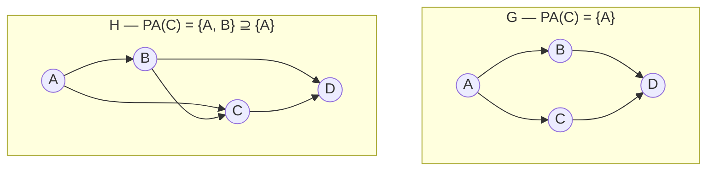

# Proof: SID for Superset Estimates
## TL;DR {#tldr}
This proof identifies exactly when SID$(G,H)$ is zero: every estimated parent set contains its true-DAG counterpart.

Extra parents preserve adjustment validity, so over-including edges preserves every intervention distribution.

Omit one true parent and an adversarial Markov distribution forces SID above zero.

## Intuition {#intuition}
Adjustment has slack: conditioning on extra ancestors need not corrupt an intervention calculation, provided no downstream variable is conditioned on.

A superset estimate keeps every real edge and may add spurious ones while still getting every intervention distribution right.

Missing a real parent is a hole, not slack. The adjustment formula drops a variable needed to block genuine confounding.

Extra edges elsewhere cannot repair it. SID therefore treats omitted edges more severely than added ones.

### Running four-node example: theorem witness

The shared pair makes both proof directions concrete. Let $G: A\to B, A\to C, B\to D, C\to D$ and $H=G+(B\to C)$.

**Worked example:** every parent set in $H$ contains its counterpart in $G$, so the forward direction proves $\mathrm{SID}(G,H)=0$. When the arguments swap, estimate $G$ omits the true $H$-parent $B$ of $C$; the graphical check finds $(C,B)$ and $(C,D)$ [§sec_9; sid.py:L183-L253].



Containment runs one way only. Reading left to right the estimate gains a parent, which is slack; reading right to left it loses one, which is a hole.

The example is not the proof itself. It is a four-node witness showing why the containment hypothesis is directional and why zero SID does not imply graph equality.

## Mechanics {#mechanics}
The proof assumes $\mathrm{pa}_H(i)\supseteq\mathrm{pa}_G(i)$ for every node. It verifies $H$'s parent sets remain valid under true graph $G$, forcing SID$(G,H)=0$ [§sec_9].

```algorithm
title: Forward direction — why a superset estimate has SID zero
lines:
  - code: "assume pa_H(i) ⊇ pa_G(i) for all nodes i"
    intent: "H never omits a true edge; it may only add extra ones [§sec_9]"
  - code: "check condition (a): no member of pa_H(i) lies on a directed i→j path in G"
    intent: "Directed paths in G use only G's edges, and every G-edge is present in H, so G's directed i→j paths are a subset of H's; a set that avoids all of H's directed paths automatically avoids the smaller set in G [§sec_9]"
  - code: "check condition (b): pa_H(i) blocks every non-directed i→j path in G"
    intent: "A non-directed path in G is built entirely from edges also present in H, so it is literally the same path in H with the same colliders and non-colliders; since pa_H(i) blocks it in H, it blocks it in G too — a path blocked in a DAG stays blocked in any sub-DAG that keeps that path's edges [§sec_9]"
  - code: "conclude pa_H(i) is a valid adjustment set for every (i,j) pair in G"
    intent: "Both conditions of the adjustment-set proposition transfer from H down to G, so the intervention distribution computed from H matches the true one for every pair, giving SID(G,H) = 0 [§sec_9]"
```

**Why transfer is one-way:** $H$ is larger, so its extra edges create more paths and blocking requirements, never fewer [§sec_9].

A surviving path in smaller $G$ is already a path in $H$, not a new path with new colliders. Validity transfers downward [§sec_9].

The converse direction shows the superset condition is necessary, not just sufficient: if H drops a true edge into some node $i$ that G has, the proof exhibits a concrete Markov distribution over G for which H's truncated adjustment set gives the wrong answer [§sec_9].

## The Math {#the-math}
**Setting up the counterexample:** take a node $i$ where G contains a parent that H's parent set for $i$ omits, and construct an observational distribution that is Markov with respect to $G$ by assigning the exogenous variables and the remaining structural assignments so that the omitted parent has a real causal effect on $i$'s distribution [§sec_9].

**Why discrepancy is forced:** true $G$'s intervention distribution depends on the omitted parent, but $H$ marginalizes it out [§sec_9].

The construction chooses graph-consistent structural equations where that parent's effect on $x_j$ is nonzero. No cancellation makes the two computations agree in general [§sec_9].

**What this buys:** one $(i,j)$ with differing distributions contributes nonzero SID [§sec_9].

One dropped true edge is therefore enough to make SID$(G,H)>0$; there is no partial credit for almost containing the parent set [§sec_9].

## Go Deeper {#go-deeper}
- **Metric Properties of SID** — the parent proposition this proof serves; it's the broader argument (of which superset-estimate correctness is one case) establishing SID's behavior as a pre-metric, including why it is not symmetric under graph swap.
- **The adjustment-set validity proposition invoked in Step 1–2 above** — the two-condition characterization (no adjustment-set member on the causal path; blocking of all non-causal paths) that this proof reduces to, rather than re-deriving from scratch.
