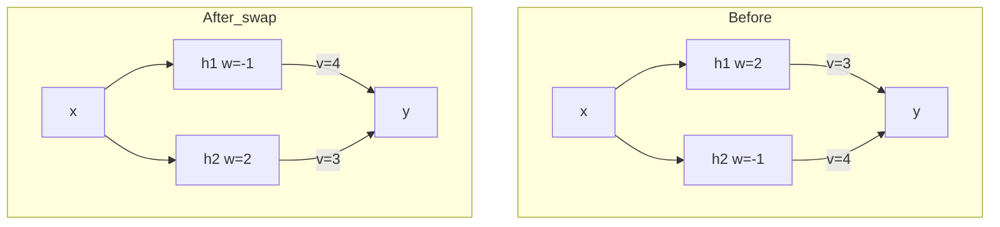

# Parameter Space Symmetry
## TL;DR {#tldr}
A parameter space symmetry is a transformation of a network's weights that leaves its function unchanged, such as swapping two hidden units together with their incoming and outgoing weights [§sec_1].

Because many such transformations exist, every minimum of the loss sits inside an orbit of functionally identical minima rather than standing alone [S1].

Continuous symmetries such as layer-wise rescaling generate conserved quantities under gradient descent, and discrete permutation symmetry lets independently trained networks be aligned and merged without a loss barrier between them [S2][S3].

## Intuition {#intuition}
Picture a hidden layer as a bag of interchangeable units rather than an ordered list. Relabeling which unit is "unit 3" and which is "unit 7," and permuting the matching rows and columns of adjacent weight matrices, changes nothing about what the network computes [§sec_1].

The same idea extends beyond permutation. Scaling a unit's incoming weights up and its outgoing weights down by a matching factor, or flipping signs on both sides of an odd activation, also leaves the output untouched — each such move is a parameter space symmetry [§sec_1].

This differs from the equivariance studied in geometric deep learning, which concerns symmetries of the *input data*, such as rotating an image. Parameter space symmetry instead acts on the weights themselves, independent of any particular input [§sec_1].

## Mechanics {#mechanics}
Formally, a parameter space symmetry is a transformation of the parameter vector that leaves the network's output function unchanged for every input, holding the architecture fixed. Such transformations compose and invert, so the full set of them forms a group [§sec_1].

Three families of transformation recur across the survey's examples [§sec_1]:
- **Permutation**: reorder hidden units within a layer, permuting the corresponding rows and columns of adjacent weight matrices [§sec_1].
- **Sign flip**: flip the sign of a unit's weights on both sides of an odd activation such as tanh [§sec_1].
- **Continuous rescaling**: scale a unit's incoming weights up and its outgoing weights down by the same positive factor, which leaves ReLU networks' output unchanged [S2].

Because these transformations compose, applying different combinations to one minimum traces out its entire symmetry orbit: a connected, typically high-dimensional manifold of parameters that all realize the same function and loss [S1]. This is why overparameterized loss landscapes contain broad flat valleys of global minima rather than isolated points [S1].

Continuous symmetries have an additional effect: by Noether's-theorem-style reasoning, each continuous symmetry direction implies a quantity conserved along gradient flow, linking the symmetry group's geometry directly to training dynamics [S2].

## The Math {#the-math}
Take a network with one hidden layer of two ReLU units feeding a linear output. Swapping the two units' full weight vectors gives a numerical check of why permutation leaves the function unchanged [§sec_1]:

- Before the swap: hidden weights $(w_1,w_2)=(2,-1)$, output weights $(v_1,v_2)=(3,4)$; for input $x=1$, output $=3\,\mathrm{ReLU}(2)+4\,\mathrm{ReLU}(-1)=6$ [§sec_1].
- After swapping units 1 and 2 in both layers: hidden weights $(w_1,w_2)=(-1,2)$, output weights $(v_1,v_2)=(4,3)$; output $=4\,\mathrm{ReLU}(-1)+3\,\mathrm{ReLU}(2)=6$ [§sec_1].
- The sum is identical because permutation only reorders which term contributes which product; every product $v_i\cdot\mathrm{ReLU}(w_i x)$ still appears exactly once [§sec_1].

The same style of check applies to continuous rescaling of a single ReLU unit's weights [S2]:

- Before rescaling: incoming weight $w=2$, outgoing weight $v=3$; for $x=1$, contribution $=3\,\mathrm{ReLU}(2)=6$ [S2].
- Scale the incoming weight by $\alpha=5$ and the outgoing weight by $1/\alpha=0.2$: new weights $w'=10$, $v'=0.6$; contribution $=0.6\,\mathrm{ReLU}(10)=6$ [S2].
- The factor $\alpha$ must be positive: ReLU is positively homogeneous, $\mathrm{ReLU}(\alpha z)=\alpha\,\mathrm{ReLU}(z)$ only for $\alpha>0$, so a negative factor would flip the sign of the hidden activation and break the identity [S2].

These two checks generalize to the theorem-level claims in the literature: permutation symmetry is exact for any activation, while rescaling depends on the activation's homogeneity, which is why sign flips handle odd activations like tanh but rescaling suffices for ReLU [§sec_1][S2].

## Go Deeper {#go-deeper}
- [Git Re-Basin: Merging Models modulo Permutation Symmetries](https://arxiv.org/abs/2209.04836) — start here: its Figure 1 is the canonical picture of permutation alignment collapsing the loss barrier between two independently trained networks.
- [git-re-basin (official code)](https://github.com/samuela/git-re-basin) — the actual permutation-matching algorithm that turns the symmetry into a runnable alignment procedure.
- [Neural Mechanics: Symmetry and Broken Conservation Laws in Deep Learning Dynamics](https://arxiv.org/abs/2012.04728) — derives, via Noether's theorem, the conserved quantities that continuous rescaling symmetry implies for gradient descent.
- [Geometry of the Loss Landscape in Overparameterized Neural Networks: Symmetries and Invariances](https://arxiv.org/abs/2105.12221) — formalizes how permutation orbits shape the geometry of the minima described above in Mechanics.
