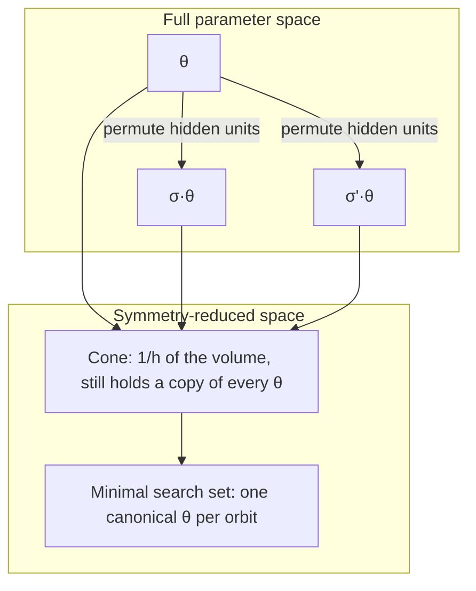

# Removing Symmetry: Model Compression and Reduced Search Space

## TL;DR {#tldr}

Removing symmetry means picking one canonical parameter vector per symmetry orbit instead of storing many parameter settings that compute the identical function. That single move shrinks storage and search space, makes Bayesian posteriors easier to sample and compare, and removes flat directions that slow down optimization.

## Intuition {#intuition}

A symmetry orbit is a set of "photographs" of the same function, each taken from a different neuron ordering or sign flip. A trained network's parameters, a stored checkpoint, and a Bayesian sampler's posterior draws all needlessly track every photograph, even though one photograph fully reconstructs the function.

Removing symmetry fixes a rule for which photograph to keep — a canonical representative — so a parameter vector and the function it computes become a one-to-one pairing again. Geometrically, this means restricting attention to a wedge of parameter space guaranteed to still touch every possible function, and always reporting the point where that wedge meets each orbit.

## Mechanics {#mechanics}

Quotienting the parameter space by its symmetry group collapses each orbit to a single representative. This does not change any loss value or any function the network computes [§sec_3_3].

It only removes redundant directions along which the loss stays constant, so the resulting quotient space is lower-dimensional and each point corresponds to a unique function [§sec_3_3].

This is the mechanism behind model compression: factoring out orthogonal symmetries in radial networks, or merging redundant nodes that arise from structural symmetries in a computational graph, both shrink storage and inference cost without touching expressivity or accuracy [§sec_3_3].

For permutation symmetry in feedforward networks with interchangeable hidden units, neuron permutations can be written as compositions of reflections in parameter space. This lets a cone be constructed that still contains a permuted copy of every point in the full parameter space [§sec_3_3].

For a two-layer network with $h$ hidden units under $S_h$ symmetry, this cone occupies only $1/h$ of the full volume. A stronger reduction, the minimal search set, contains no two points related by symmetry at all [§sec_3_3].

Empirically, removing permutation and scaling symmetry makes trained networks more linearly mode connected, and the loss decreases more monotonically along the linear path between initialization and the trained parameters [§sec_3_3].

In Bayesian neural networks, symmetry makes the posterior multi-modal in a functionally redundant way, which slows MCMC mixing and complicates interpretation [§sec_3_3].

Mapping each sample to its canonical representative — quotienting out permutation or sign-flip symmetry — lets sampling explore a more informative, functionally diverse set of solutions, and lets trained Bayesian networks be compared directly across different sampling methods [§sec_3_3].

Symmetry-induced flat directions also produce plateaus and saddle points in the loss surface. Projecting the loss landscape onto the symmetry-reduced space removes these degenerate directions, yielding a surface closer to strictly convex; continuous symmetries can even be used to reformulate a nonconvex loss as linear optimization over a convex polytope [§sec_3_3].

## The Math {#the-math}

The section gives one concrete quantitative claim to reason from: for a two-layer network with $h$ hidden units under $S_h$ symmetry, the cone occupies $1/h$ of the parameter space, while the full permutation group has order $h!$. That gap explains why the cone alone is not the minimal search set [§sec_3_3].

If the cone held exactly one representative per orbit, its volume fraction would need to be $1/h!$. Instead it is $1/h$, which is larger for every $h>2$, so the cone still contains multiple permuted copies of most points [§sec_3_3].

The expected number of copies of a given function still present inside the cone is $h!/h=(h-1)!$ [§sec_3_3].

| $h$ | $h!$ (full orbit size) | Cone fraction | Copies still inside cone, $(h-1)!$ |
|---|---|---|---|
| 1 | 1 | 1 | 1 [§sec_3_3] |
| 2 | 2 | 1/2 | 1 [§sec_3_3] |
| 3 | 6 | 1/3 | 2 [§sec_3_3] |
| 4 | 24 | 1/4 | 6 [§sec_3_3] |

At $h=1$ there is nothing to permute, $S_1$ is trivial, and the cone correctly covers the entire space. From $h=2$ on, the gap widens quickly: at $h=4$ the cone is only $4\times$ smaller than the full space, but a truly duplicate-free set would need to be $24\times$ smaller [§sec_3_3].

This is exactly the gap the minimal search set closes — it is a strictly smaller, duplicate-free refinement of the cone, not the same construction under a different name [§sec_3_3].

## Go Deeper {#go-deeper}

No external resource is attached to this concept in the research note, so the pointers below stay inside the evidence already supplied for this page.

The convex-polytope reformulation is worth tracing further: using continuous symmetries to rewrite a nonconvex loss as linear optimization over a polytope turns a hard optimization problem into a computationally tractable one, and it is the clearest example in this section of symmetry removal changing not just storage but the difficulty class of training itself [§sec_3_3].

The Bayesian canonicalization result also points forward: comparing trained networks across different sampling methods only works once each sample has been mapped to the same canonical representative, which makes symmetry removal a prerequisite for evaluation, not just an optimization convenience [§sec_3_3].

This concept builds on the identifiability question of which parameter settings compute the same function, and its consequences feed back into the broader picture of how symmetry structures the loss landscape as a whole [§sec_3_3].
