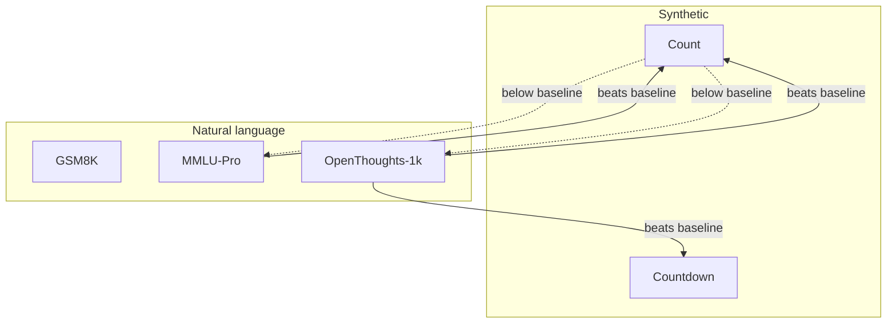

That tool call wasn't needed for this task — apologies. Here's the concept page directly.

```markdown
# Cross-Dataset Generalization
## TL;DR {#tldr}
The cross-dataset transfer matrix for the Remaining Count Probe is asymmetric: probes trained on natural-language datasets (OpenThoughts-1k, MMLU-Pro, GSM8K) transfer to the synthetic Count/Countdown tasks, but probes trained on the synthetic tasks fail to transfer back to natural language. The authors read this as a regularization effect — natural text forces the probe onto the model's general length-tracking direction, while synthetic tasks let it latch onto a narrower, dataset-specific shortcut.

## Intuition {#intuition}
A probe trained on a dataset where "remaining length" correlates with one obvious surface cue can fit that cue instead of the underlying mechanism, and that fit won't survive a dataset where the cue disappears. A probe trained on messy, heterogeneous data has no such shortcut available and is forced toward whatever direction actually tracks length everywhere.

This mirrors a pattern reported for truth probes: Burns et al. found Contrast-Consistent Search probes trained on datasets with less domain-specific "shortcut" structure generalized outward better than probes trained on datasets riddled with such structure, producing the same kind of asymmetric transfer matrix [S1]. Marks and Tegmark later found the identical asymmetry for factual true/false probes — simple, unambiguous statements transfer broadly, while negated or conjunctive statements transfer poorly even back to their own un-negated form [S2]. In both cases, and in this paper's case, the asymmetry is diagnostic of *which* dataset isolates the real direction rather than a lucky nuisance correlation.

## Mechanics {#mechanics}
The procedure trains one probe per dataset and scores it against every dataset's held-out split, turning the pairwise results into a matrix:

```algorithm
title: Building the cross-dataset generalization matrix
lines:
  - code: "for train_dataset in datasets:"
    intent: "Fit a fresh Remaining Count Probe using only this dataset's activations and remaining-token labels [§sec_5]"
  - code: "    for eval_dataset in datasets:"
    intent: "Score that same probe's MAE on every other dataset's held-out split, including its own [§sec_5]"
  - code: "        matrix[train_dataset][eval_dataset] = MAE(probe, eval_dataset)"
    intent: "Off-diagonal entries reveal whether the probe direction generalizes past the corpus it was fit on [§sec_5]"
```

The full Llama-3.1-8B-Instruct matrix, with each train-dataset row followed by its own median-baseline row, is reproduced below [tab_3]:

| Train → Eval | Count | Countdown | GSM8K | MMLU-Pro | OpenThoughts-1k | Source |
|---|---|---|---|---|---|---|
| Count (probe) | 35.07 | 99.17 | 101.21 | 228.93 | 280.02 | [tab_3] |
| Count (baseline) | 117.81 | 117.82 | 87.12 | 176.54 | 208.25 | [tab_3] |
| Countdown (probe) | 183.81 | 4.13 | 87.84 | 236.40 | 278.57 | [tab_3] |
| Countdown (baseline) | 117.81 | 117.82 | 87.12 | 176.54 | 208.25 | [tab_3] |
| GSM8K (probe) | 130.91 | 149.68 | 38.79 | 164.27 | 199.74 | [tab_3] |
| GSM8K (baseline) | 129.59 | 129.59 | 70.15 | 201.75 | 241.90 | [tab_3] |
| MMLU-Pro (probe) | 105.01 | 118.96 | 63.57 | 121.51 | 147.25 | [tab_3] |
| MMLU-Pro (baseline) | 118.83 | 118.84 | 98.93 | 172.68 | 201.28 | [tab_3] |
| OpenThoughts-1k (probe) | 100.37 | 101.03 | 107.94 | 133.05 | 136.69 | [tab_3] |
| OpenThoughts-1k (baseline) | 147.44 | 147.45 | 175.60 | 175.51 | 187.83 | [tab_3] |

Reading the matrix: the diagonal is the best entry in every row, and most off-diagonal entries still sit below the baseline for that cell, meaning the transferred probe direction carries real length information rather than nothing at all [§sec_5]. The failure mode is one-directional rather than uniform:



Within the synthetic pair the probes transfer cleanly to each other — Count→Countdown beats the Countdown baseline — consistent with Count and Countdown sharing near-identical surface structure [§sec_5]. Mistral-7B-Instruct-v0.3 and Olmo-3-7B-Instruct reproduce the same asymmetric picture in their own matrices, with Olmo's covering all seven available datasets rather than five [§sec_5].

A tokens-per-character explanation is ruled out because it predicts symmetric failures, and the matrix instead shows a strictly one-way pattern — natural-language probes transfer broadly across GSM8K, MMLU-Pro, OpenThoughts-1k, and TriviaQA despite their differing tokenization profiles [§sec_5]. A shared-BPE replication that would pin this down further is left to follow-up work [§sec_5].

## The Math {#the-math}
The Count-trained probe's in-domain error is 35.07 against a 117.81 baseline, a ratio of 0.298 — it cuts baseline error by roughly 70% on its own corpus [tab_3]. On MMLU-Pro that same probe scores 228.93 against a 176.54 baseline, a ratio of 1.30 — 30% *worse* than a baseline that ignores the model entirely [tab_3]. The swing between those two ratios (1.30 / 0.298 ≈ 4.4×) is the arithmetic signature of a probe that fit a feature specific to Count rather than a length-tracking direction general enough to survive the domain shift [tab_3].

Contrast that with the natural-language side. OpenThoughts-1k transfers to GSM8K at 107.94 against a 175.60 baseline (ratio 0.615, a 38% reduction), even though GSM8K's own in-domain probe reaches 38.79 against its own 70.15 baseline (ratio 0.553) [tab_3]. The transferred probe is about 2.8× worse in absolute MAE than the in-domain one, but it still clears its baseline by a comparable margin — the gap is in how much signal survives, not in the direction of the effect [tab_3].

The pattern is not perfectly uniform even within the natural-language row: MMLU-Pro-trained probe scores 118.96 on Countdown against a 118.84 baseline, a ratio of 1.001 — essentially a tie rather than a clear win [tab_3]. The clean sweep across every column belongs to OpenThoughts-1k, whose row beats baseline in all five cells; MMLU-Pro's row is broadly favorable but not uniformly so [tab_3].

The OpenThoughts-1k baseline row is itself informative about why "beats baseline" is a real bar there rather than a low one: it ranges from 147 to 188 across columns, far above the other rows' baselines (70–130), because it is a constant predictor set to OpenThoughts-1k's own median completion length and then scored against much shorter completions in GSM8K, MMLU-Pro, and the synthetic sets [tab_3]. That the OpenThoughts probe still beats even this ill-fitted baseline in every column is the strongest single piece of evidence for broad transfer in the matrix [tab_3].

## Go Deeper {#go-deeper}
- [Discovering Latent Knowledge in Language Models Without Supervision](https://arxiv.org/abs/2212.03827) — the original CCS paper whose cross-dataset accuracy heatmap shows the same asymmetric-transfer shape this section reports for length probes; start here to see the pattern in its first context.
- [The Geometry of Truth: Emergent Linear Structure in Large Language Model Representations](https://arxiv.org/abs/2310.06824) — replicates the asymmetric transfer phenomenon for factual true/false probes and clarifies which dataset properties (negation, conjunction) drive it, useful for reasoning about *why* synthetic datasets underperform here.
- [discovering_latent_knowledge (official CCS code)](https://github.com/collin-burns/discovering_latent_knowledge) — the reference implementation of the extraction-and-evaluation pipeline used to build this kind of matrix, useful if reproducing a similar cross-dataset grid.
```
