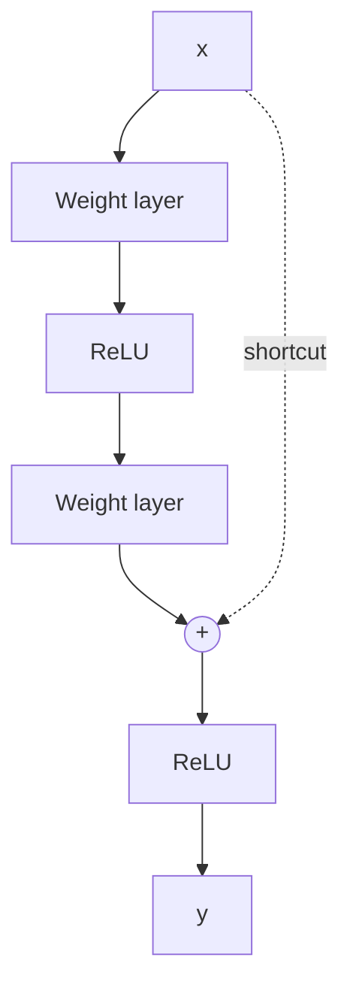

# Building Block Diagram

## TL;DR {#tldr}
A residual building block computes y = F(x, {W_i}) + x: a small stack of layers learns F, and the block adds back the unchanged input x before the final nonlinearity [eq_1].

## Intuition {#intuition}
Instead of asking a stack of layers to learn the entire mapping from x to y, the block asks them to learn only the residual F(x): whatever must be added to x to reach the desired output. The shortcut then supplies x itself, unchanged [§sec_3_2][eq_1].

If x is already close to what the block should output, driving F toward zero is an easier target for the weight layers than reconstructing x from nothing [§sec_3_2].

## Mechanics {#mechanics}
The two-layer block from the paper's own figure has one path through weight layers and ReLU, and a second, parallel identity path that rejoins it before the final nonlinearity [§sec_3_2].



For this two-layer example, F(x, {W_i}) = W_2 σ(W_1 x), where σ denotes ReLU and biases are omitted for simplicity; the shortcut then adds x to that result [§sec_3_2].

The second ReLU is applied after the addition, not after each weight layer separately — the block's output nonlinearity sees F(x) + x as a whole [§sec_3_2].

The shortcut connection performs only element-wise addition: no extra parameters and no extra multiply-accumulate operations beyond that addition [§sec_3_2].

That is what lets the paper compare plain and residual networks fairly — matched parameter count, depth, width, and computational cost, differing only in whether shortcuts are present [§sec_3_2].

Eq_1's addition requires x and F(x) to have equal dimensions. When a block changes the number of channels, the shortcut cannot carry x through unchanged [§sec_3_2].

The paper's fix is a linear projection: y = F(x, {W_i}) + W_s x, with W_s applied only where dimensions must be matched, not as a default replacement for the identity shortcut [eq_2].

```figure
id: fig_3
caption: The dotted shortcuts mark exactly where dimensions change and eq_2's projection W_s is needed, unlike the plain identity shortcut of eq_1 elsewhere in the network [§sec_3_2]
```

## The Math {#the-math}
$$
\ve{y}= \mathcal{F}(\ve{x}, \{W_{i}\}) + \ve{x}
$$
[eq_1]

x and y are the input and output vectors of the layers considered, and F represents the residual mapping to be learned; the addition is element-wise, and for convolutional layers is performed channel by channel on the feature maps [§sec_3_2].

If F is restricted to a single layer, eq_1 reduces to y = W_1 x + x — a linear layer plus identity, equivalent to y = (W_1 + I)x. The paper reports no observed advantage from this case [§sec_3_2].

$$
\ve{y}= \mathcal{F}(\ve{x}, \{W_{i}\}) + W_{s}\ve{x}
$$
[eq_2]

W_s is a learned linear projection applied to x, used only when the dimensions of x and F(x) mismatch — for instance where channel counts change between blocks [§sec_3_2].

A square W_s (same dimension as identity) is also possible, but the paper reports no advantage over the identity shortcut, so W_s is reserved for the dimension-matching case rather than used throughout [§sec_3_2].

The form of F is flexible: the paper's experiments use two or three layers, though more are possible in principle [§sec_3_2].

A single-layer F degenerates to the linear-plus-identity case above, y = (W_1 + I)x, for which no advantage was observed — the block's benefit comes from F having enough depth to represent a genuine nonlinear residual, not from the addition alone [§sec_3_2].

**Checking the "negligible addition" claim against fig_3's numbers:** the 34-layer residual network costs 3.6 billion FLOPs — identical to its plain 34-layer counterpart of the same depth and width [§sec_3_2].

That equality only holds because eq_1 adds one element-wise addition per output, not a new weight layer — the convolutions inside F dominate the FLOP count, so the shortcut's own cost is negligible beside them [eq_1][§sec_3_2].

## Go Deeper {#go-deeper}
Although the notation above is written for fully-connected layers, the same block applies to convolutional layers, with F standing for one or more convolutions and the addition performed feature map by feature map [§sec_3_2].

The paper does not explore blocks where F has more than three layers in this section, leaving open how the identity-shortcut argument extends to much deeper residual functions [§sec_3_2].
