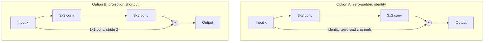

# Residual Network
## TL;DR {#tldr}
A Residual Network adds shortcut connections around groups of layers in a plain, VGG-style deep conv net, so each block learns a residual mapping added onto its input instead of replacing it outright. The 34-layer version runs at only ~18% of VGG-19's FLOPs, and the shortcuts add no extra parameters over the plain baseline [§sec_3_3].

## Intuition {#intuition}
Very deep plain networks are hard to optimize well: stacking more layers doesn't guarantee a better fit, because it's hard for a long stack of nonlinear layers to learn the identity mapping a very deep net sometimes needs. A shortcut sidesteps this — instead of asking a block to learn the whole output from scratch, it asks the block to learn only the *difference* from its input, and the input is added back in for free.

That reframing is why Residual Network builds on the identity-mapping-by-shortcuts idea, and why it's compared directly against the Plain Network it's built from — same layer budget, same filter-size rules, with the shortcut path as the only structural change.

## Mechanics {#mechanics}
The plain baseline follows two simple rules borrowed from VGG-style design: layers producing the same output feature-map size keep the same number of filters, and when the feature-map size is halved the number of filters is doubled, which keeps the time complexity per layer roughly constant [§sec_3_3].

Downsampling is done by convolutional layers with stride 2 rather than pooling layers, and the network ends in a global average pooling layer feeding a 1000-way fully-connected softmax layer [§sec_3_3].

Despite going deeper, the 34-layer plain baseline is far cheaper than VGG-19: 3.6 billion FLOPs against VGG-19's 19.6 billion [§sec_3_3].

Shortcut connections are inserted into this same plain network to turn it into its residual counterpart — no layers are removed or resized, only the shortcut paths are added [§sec_3_3].

When a shortcut's input and output already match in dimension, it's a plain identity mapping — the solid-line shortcuts — adding no parameters or extra computation [§sec_3_3].

When a shortcut crosses a point where the filter count increases (dotted-line shortcuts), dimensions no longer match, and the paper considers two fixes:
- **Option A:** keep the identity mapping and pad the extra channels with zeros — introduces no extra parameters [§sec_3_3].
- **Option B:** use a 1×1 projection convolution to map the input into the new dimension [§sec_3_3].

Either way, when a shortcut spans two feature-map sizes it's applied with stride 2, matching the stride used by the main path [§sec_3_3].

These two options differ only in how the shortcut path matches dimensions; the main computation path is identical either way:



The paper instantiates this design at five depths, varying only how many residual blocks are stacked in each stage:

| Depth | conv2_x blocks | conv3_x blocks | conv4_x blocks | conv5_x blocks | FLOPs |
|---|---|---|---|---|---|
| 18-layer | 2 | 2 | 2 | 2 | 1.8×10⁹ [tab_1] |
| 34-layer | 3 | 4 | 6 | 3 | 3.6×10⁹ [tab_1] |
| 50-layer | 3 | 4 | 6 | 3 | 3.8×10⁹ [tab_1] |
| 101-layer | 3 | 4 | 23 | 3 | 7.6×10⁹ [tab_1] |
| 152-layer | 3 | 8 | 36 | 3 | 11.3×10⁹ [tab_1] |

```figure
id: fig_4
caption: Why the shortcut matters — 34-layer plain training error sits above the 18-layer plain's (left), while 34-layer ResNet's drops below the 18-layer ResNet's (right), at equal parameter count [fig_4]
```

## The Math {#the-math}
The 34-layer plain baseline runs at 3.6 billion FLOPs against VGG-19's 19.6 billion: 3.6 / 19.6 ≈ 0.184, so despite going from VGG-19's 19 weighted layers to 34, it costs only about 18% of VGG-19's compute [§sec_3_3].

That efficiency isn't accidental: design rule (ii) — double the filter count whenever the feature-map size is halved — is chosen specifically to preserve the time complexity per layer, so adding depth within a stage stays cheap even where VGG's uniform 3×3-filters-everywhere approach doesn't [§sec_3_3].

The FLOPs table shows the same effect at the block level. The 34-layer and 50-layer nets stack identical block counts per stage (3, 4, 6, 3), but 50-layer blocks use 3 convolutions each instead of 2 — 48 weighted conv layers against 32, a 1.5× increase. FLOPs only rise from 3.6 to 3.8 billion, a 1.056× increase [tab_1].

Beyond 50 layers, FLOPs scale roughly with block count once that bottleneck shape is fixed: going from 50-layer's 16 blocks to 152-layer's 50 blocks (3.1×) takes FLOPs from 3.8 to 11.3 billion (2.97×) — depth grows almost for free once the per-block cost is fixed [tab_1].

## Go Deeper {#go-deeper}
- Why identity shortcuts need matching dimensions, and how the bottleneck block shape (used from 50 layers up) keeps parameter and FLOP growth sublinear even as block counts grow, is covered under Bottleneck Design.
- The degradation problem that motivates the shortcut in the first place — why a plain net doesn't just learn an identity mapping on its own when that's the optimal solution — is covered under Identity Mapping by Shortcuts.
- Contrast with Plain Network: same filter and stride rules, same depth, only the shortcut paths differ — yet fig_4 shows this changes training dynamics rather than merely capping capacity [fig_4].
