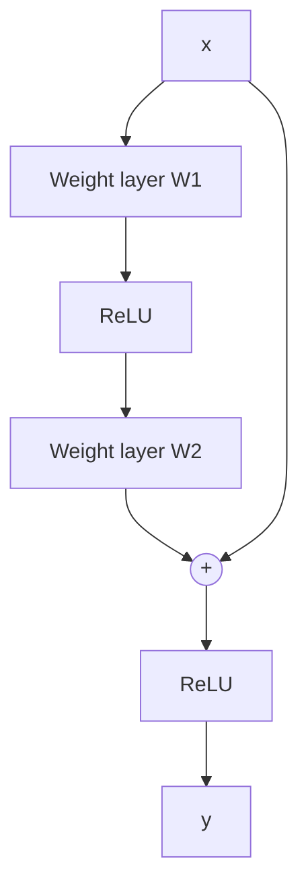

Writing the concept page now for `y = F(x,{Wi}) + x` from the ResNet paper's identity-shortcut section.

# y = F(x,{Wi}) + x
## TL;DR {#tldr}
A residual building block adds its own input back onto the output of a small stack of weight layers, so those layers only have to learn the correction to identity rather than the full mapping from scratch.

## Intuition {#intuition}
Stacking ordinary layers forces every one of them to reconstruct whatever the input already represents, plus whatever new transformation is needed — reproducing even a plain identity mapping requires the nonlinear layers to work for it.

A shortcut that adds the block's input straight to its output reframes the job: the stacked layers only have to learn the residual, the small correction on top of doing nothing. If those layers converge toward outputting zero, the whole block behaves like an identity mapping for free — exactly the fallback a deep network needs when extra depth isn't helping.

## Mechanics {#mechanics}
The block takes the input vector $x$ and forms the output vector $y$ by wiring a function $\mathcal{F}(x,\{W_i\})$ — the residual mapping to be learned — in parallel with a shortcut, then combining the two by element-wise addition [eq_1].



In the two-layer example the paper builds around, $\mathcal{F}$ is realized as two stacked weight layers with a ReLU nonlinearity between them, and biases are dropped from the notation for simplicity [§sec_3_2].

The paper applies the second nonlinearity after the addition rather than inside $\mathcal{F}$, so the shortcut path and the $\mathcal{F}$ path both feed into one ReLU that closes the block [§sec_3_2].

Because the shortcut is a plain identity connection, it adds neither parameters nor multiply-accumulate operations — which is what lets a plain network and its residual counterpart be compared with identical parameter count, depth, width, and computational cost [§sec_3_2].

Eqn.(1) only typechecks when $x$ and $\mathcal{F}(x)$ have equal dimensionality; the paper handles the two cases differently:
- **Dimensions already match:** the addition in Eqn.(1) applies directly, with no extra machinery [eq_1].
- **Dimensions differ** — typically when a block changes the channel count: the shortcut instead carries a learned linear projection $W_s$ before the addition [eq_2].
- **Which to prefer:** the paper finds by experiment that identity is sufficient to address the degradation problem, so the projection is used only where dimensions force it, keeping the extra parameters to a minimum [§sec_3_2].

The same notation extends past fully-connected layers: $\mathcal{F}$ can stand for a stack of convolutional layers, and the addition happens feature map by feature map, channel by channel [§sec_3_2].

## The Math {#the-math}
$$\ve{y}= \mathcal{F}(\ve{x}, \{W_{i}\}) + \ve{x}$$
[eq_1]

```annotated-eq
latex: "\\ve{y}= \\mathcal{F}(\\ve{x}, \\{W_{i}\\}) + \\ve{x}"
terms:
  - tex: "\\ve{y}"
    role: 1
    words: "The block's output vector, formed after the residual and shortcut paths merge [eq_1]"
  - tex: "\\mathcal{F}(\\ve{x}, \\{W_{i}\\})"
    role: 2
    words: "The residual mapping to be learned — realized in the paper's example as two weight layers with a ReLU between them [§sec_3_2]"
  - tex: "\\ve{x}"
    role: 3
    words: "The block's input, carried unchanged across the shortcut connection and added element-wise to the residual output [eq_1]"
```

$$\ve{y}= \mathcal{F}(\ve{x}, \{W_{i}\}) + W_{s}\ve{x}$$
[eq_2]

Eqn.(2) is the general form of the block: replacing the identity shortcut with a learned matrix $W_s$ recovers Eqn.(1) as the special case $W_s = I$, and is the form actually used whenever the block changes dimensions [eq_2].

```derivation
shape: Collapse Eqn.(1) to a single-layer F to see why depth inside the block matters
steps:
  - latex: "\\ve{y} = \\mathcal{F}(\\ve{x}, \\{W_i\\}) + \\ve{x}, \\quad \\mathcal{F}(\\ve{x}) = W_1\\ve{x}"
    why: "Taking the residual function down to one weight layer removes the nonlinearity between weights entirely [§sec_3_2]"
  - latex: "\\ve{y} = W_1\\ve{x} + \\ve{x} = (W_1 + I)\\ve{x}"
    why: "The shortcut only shifts the single matrix by the identity, so the block becomes algebraically indistinguishable from one ordinary linear layer — the paper reports no observed advantage in this degenerate case [§sec_3_2]"
```

## Go Deeper {#go-deeper}
```figure
id: fig_3
caption: The 34-layer residual network (right) versus its plain counterpart (middle) at identical depth and FLOPs — dotted shortcuts mark exactly the blocks where Eqn.(2)'s projection is needed to change channel count [§sec_3_2]
```

Across the full network, most blocks use the parameter-free Eqn.(1) shortcut; only where downsampling changes channel width does a block pay the extra cost of Eqn.(2)'s projection, which is why the residual and plain 34-layer networks in the figure both come out at 3.6 billion FLOPs versus VGG-19's 19.6 billion [fig_3].
